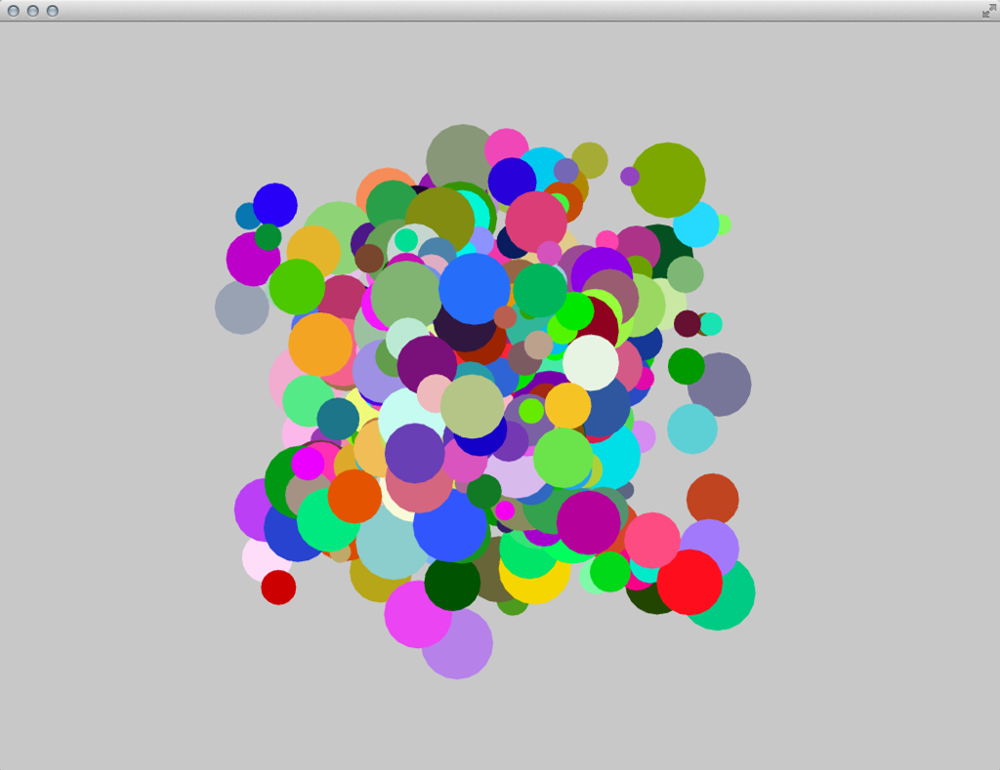

# Ooops! = Object Oriented Programming + Classes
# Ooops! = 面向对象编程 + 类


## Overview
## 概述

This tutorial is a quick and practical introduction to Object Oriented Programming in openFrameworks and a how-to guide to build and use your own classes.
By the end of this chapter you should understand how to create your own objects and have a lot of balls bouncing on your screen!

本教程是openFrameworks中面向对象编程的一个快速和实用的介绍，以及一个如何构建和使用自己的类的指南。到本章结束，你应该明白如何创建自己的对象，并有很多球弹跳在你的屏幕上！



## What is Object Oriented Programming
## 什么是面向对象编程

Object Oriented Programming (OOP) is a programming paradigm based on the use of objects and their interactions. A recurring analogy is to see a "class" as a cookie cutter that can create many cookies, the "objects".
Some terms and definitions used within OOP are listed below:

面向对象编程（OOP）是基于对象及其交互的使用的编程范例。一个反复的类比是看到一个“类”作为一个cookie切割器，可以创建许多cookie，“对象”。
OOP中使用的一些术语和定义如下：

- A class defines the characteristics of a thing - the object - and its behaviours; it defines not only its properties and attributes but also what it can do.

- An object is an instance of a class.

- The methods are the objects abilities.

- 类定义了一个东西的特征 - 对象及其行为;它不仅定义其属性和属性，还定义它可以做什么。

- 对象是类的实例。

- 方法是对象的能力。

## How to build your own Classes (simple Class)
##如何构建自己的类（简单类）

Classes and objects are the fundamental part of Object Oriented programming.
Because cooking, like coding, is fun and we tend to experiment in the kitchen let's continue with the classic metaphor of a cookie cutter as a class, defining its interactions, capabilities and affordances, and cookies as the objects.
Every class has two files: a header file, also known as a declarations file with the termination '.h' and an implementation file, terminating in '.cpp'.
A very easy way of knowing what these two files do is to think of the header file (.h) as a recipe, a list of the main ingredients of your cookie. The implementation file (.cpp) is what we're going to do with them, how you mix and work them to be the perfect cookie!
So let's see how it works:

类和对象是面向对象编程的基本部分。
因为烹饪，比如编码，很有趣，我们倾向于在厨房做实验，让我们继续把一个饼干切割器的经典比喻作为一个类，定义它的交互，能力和可用性，以及饼干作为对象。
每个类都有两个文件：头文件，也称为终止'.h'的声明文件和一个以.cpp结尾的实现文件。
一个非常简单的方法知道这两个文件做的是把头文件（.h）作为一个配方，你的cookie的主要成分的列表。实现文件（.cpp）是我们将要做的，如何混合和工作，他们是完美的饼干！
让我们看看它是如何工作的：

First of all let's create the two class files: 
If you're using Xcode as your IDE (it stands for: Integrated Development Environment), select the src folder and left Click (or CTRL + click), on the pop-up menu select 'New File' and you'll be taken to a new window menu, choose the appropriate platform you're developing for (OS X or iOS) and select C++ class and finally choose a name (we used 'Ball'). You'll automatically see the two files in your 'src' folder: 'Ball.h' and 'Ball.cpp'.
If you are using Code::Blocks create a new project from empty one given inside the "examples" directory (or check out the ProjectGenerator). Copy the folder "empty" and rename it to "OOP". Change into this new directory, copy the "emptyExample" and rename it to "ball1". Inside the "ball1" directory rename "emptyExample.workspace" to "ball1.workspace" and "emptyExample.cbp" to "ball1.cbp". Now you have a dedicated directory and a dedicated project to play around with. Open "ball1.cbp" with Code::Blocks , right-click on the "emptyExample" workspace, select "Properties" (last entry in the list) and change the title of the project. The "src" directory in your project contains all the files you need to edit in this chapter. Add two new files inside the 'src' directory by either using 'File'->'New'->'Empty File' or pressing Tab+Ctrl+N. One file should be named 'Ball.h' and the other 'Ball.cpp'.
Now let's edit your class header (.h) file. Feel free to delete all its contents and let's start from scratch:
Declare a class in the header file (.h). In this case, the file name should be Ball.h. 
Follow the code below and type into your own Ball.h file, please note the comments I've included to guide you along.

首先让我们创建两个类文件：
如果你使用Xcode作为你的IDE（它代表：集成开发环境），选择src文件夹，左点击（或CTRL +点击），在弹出菜单上选择'新文件'，你会被采取到一个新的窗口菜单，选择你正在开发的适当的平台（OS X或iOS），选择C ++类，最后选择一个名称（我们使用'球'）。你会自动看到'src'文件夹中的两个文件：'Ball.h'和'Ball.cpp'。
如果你使用Code :: Blocks在“examples”目录中创建一个来自空的新项目（或者检查ProjectGenerator）。复制文件夹“empty”并将其重命名为“OOP”。切换到这个新目录，复制“emptyExample”并将其重命名为“ball1”。在“ball1”目录中，将“emptyExample.workspace”重命名为“ball1.workspace”，将“emptyExample.cbp”重命名为“ball1.cbp”。现在你有一个专用的目录和一个专门的项目来玩。用Code :: Blocks打开“ball1.cbp”，右键单击“emptyExample”工作区，选择“属性”（列表中的最后一个条目）并更改项目的标题。项目中的“src”目录包含本章需要编辑的所有文件。通过使用'文件' - >'新' - >'空文件'或按Tab + Ctrl + N，在'src'目录中添加两个新文件。一个文件应命名为“Ball.h”，另一个文件应为“Ball.cpp”。
现在让我们编辑你的类头文件（.h）。随意删除其所有内容，让我们从头开始：
在头文件（.h）中声明一个类。在这种情况下，文件名应为Ball.h.
按照下面的代码，并输入到您自己的Ball.h文件，请注意我包括的评论，以指导您。


```cpp
#ifndef _BALL // if this class hasn't been defined, the program can define it
#define _BALL // by using this if statement you prevent the class to be called more than once which would confuse the compiler
#include "ofMain.h" // we need to include this to have a reference to the openFrameworks framework
class Ball {

    public: // place public functions or variables declarations here

    // methods, equivalent to specific functions of your class objects
    void setup();	//setup method, use this to setup your object's initial state
    void update();  // update method, used to refresh your objects properties
    void draw();    // draw method, this where you'll do the object's drawing 

    // variables
    float x;        // position
    float y;
    float speedY;   // speed and direction
    float speedX;
    int dim;        // size
    ofColor color;  // color using ofColor type

    Ball();  // constructor - used to initialize an object, if no properties are passed the program sets them to the default value
    private: // place private functions or variables declarations here
}; // don't forget the semicolon!
#endif
```

```cpp
#ifndef _BALL //如果这个类没有被定义，程序可以定义它
#define _BALL //通过使用这个if语句，防止类被多次调用，这将混淆编译器
#include“ofMain.h”//我们需要包含这个来引用openFrameworks框架
类Ball {

    public：//在这里放置公共函数或变量声明

    //方法，等同于你的类对象的具体函数
    void setup（）; //设置方法，使用它来设置对象的初始状态
    void update（）; //更新方法，用于刷新对象的属性
    void draw（）; //绘制方法，这里你将做对象的绘制

    //变量
    float x; //位置
    float y;
    float speedY; //速度和方向
    float speedX;
    int dim; // size
    的颜色; // color使用color类型

    球（）; // constructor  - 用于初始化对象，如果没有传递属性，程序将它们设置为默认值
    private：//在这里放置私有函数或变量声明
}; //不要忘记分号！
＃万一
```

We have declared the Ball class header file (the list of ingredients) and now lets get to the cooking part to see what these ingredients can do!
Please notice the '#include' tag. This is a way to tell the [compiler](http://www.cplusplus.com/doc/tutorial/introduction/ "Compiler introduction on cplusplus.com") ([wikipedia](https://en.wikipedia.org/wiki/Compiler "Wikipedia on compilers")) about any files to include in the implementation file. When the program is compiled these '#include' tags will be replaced by the original file they're referring to.
The 'if statement' (#ifndef) is a way to prevent the repetition of header files which could easily occur. This is called an [include guard](https://en.wikipedia.org/wiki/Include_guard "Wikipedia on include guards"). Using this pattern helps the compiler to only include the file once and avoid repetition. Don't worry about this now, we'll talk about it later on!

We will now create a class for a ball object. This ball will have color, speed and direction properties: it will move across the screen and bounce against the wall. Some of these properties we will create with randomized attributes but we'll be careful to create the right logic for its motion behaviours.

Here's how you can write the class *.cpp file, the implementation file:

我们已经宣布Ball类头文件（成分列表），现在让我们到烹饪部分看看这些成分可以做什么！
请注意“#include”标记。这是一种告诉[编译器]（http://www.cplusplus.com/doc/tutorial/introduction/“cplusplus.com上的编译器简介”）（[wikipedia]（https://en.wikipedia.org） / wiki / Compiler“Wikipedia on compilers”））关于要包括在实现文件中的任何文件。当程序被编译时，这些'#include'标签将被它们所引用的原始文件所替换。
'if语句'（#ifndef）是一种防止可能容易出现的头文件重复的方法。这被称为[包括守卫]（https://en.wikipedia.org/wiki/Include_guard“维基百科包含守卫”）。使用此模式有助于编译器只包含文件一次，并避免重复。现在不要担心，我们以后再谈吧！

我们现在将为一个球对象创建一个类。这个球将具有颜色，速度和方向属性：它将移动穿过屏幕和反弹在墙上。我们将使用随机属性创建这些属性中的一些，但是我们会小心为其运动行为创建正确的逻辑。

这里是如何编写类* .cpp文件，实现文件：

```cpp
#include "Ball.h"
Ball::Ball(){
}

void Ball::setup(){
    x = ofRandom(0, ofGetWidth());      // give some random positioning
    y = ofRandom(0, ofGetHeight());

    speedX = ofRandom(-1, 1);           // and random speed and direction
    speedY = ofRandom(-1, 1);

    dim = 20;

    color.set(ofRandom(255),ofRandom(255),ofRandom(255)); // one way of defining digital color is by addressing its 3 components individually (Red, Green, Blue) in a value from 0-255, in this example we're setting each to a random value
}

void Ball::update(){
    if(x < 0 ){
        x = 0;
        speedX *= -1;
    } else if(x > ofGetWidth()){
        x = ofGetWidth();
        speedX *= -1;
    }

    if(y < 0 ){
        y = 0;
        speedY *= -1;
    } else if(y > ofGetHeight()){
        y = ofGetHeight();
        speedY *= -1;
    }

    x+=speedX;
    y+=speedY;
}

void Ball::draw(){
    ofSetColor(color);
    ofCircle(x, y, dim);
}
```

```cpp
#include“Ball.h”
Ball :: Ball（）{
}}

void Ball :: setup（）{
    x = ofRandom（0，ofGetWidth（））; //给一些随机定位
    y = ofRandom（0，ofGetHeight（））;

    speedX = ofRandom（-1，1）; //和随机速度和方向
    speedY = ofRandom（-1，1）;

    dim = 20;

    color.set（ofRandom（255），ofRandom（255），ofandand（255））; //定义数字颜色的一种方法是通过以0-255的值单独寻址其3个组件（红色，绿色，蓝色），在此示例中，我们将每个组件设置为随机值
}}

void Ball：update（）{
    if（x <0）{
        x = 0;
        speedX * = -1;
    } else if（x> ofGetWidth（））{
        x = ofGetWidth（）;
        speedX * = -1;
    }}

    if（y <0）{
        y = 0;
        speedY * =  -  1;
    } else if（y> ofGetHeight（））{
        y = ofGetHeight（）;
        speedY * = -1;
    }}

    x + = speedX;
    y + = speedY;
}}

void Ball :: draw（）{
    ofSetColor（color）;
    ofCircle（x，y，dim）;
}}
```

Now, this is such a simple program that we could have written it inside our ofApp(.h and .cpp) files and that would make sense if we didn't want to reuse this code elsewhere. One of the advantages of Object Oriented Programming is reuse. Imagine we want to create thousands of these balls. The code could easily get messy without OOP. By creating our own class we can later re-create as many objects as we need from it and just call the appropriate methods when needed keeping our code clean and efficient. In a more pragmatic example think of creating a class for each of your user-interface (UI) elements (button, slider, etc) and how easy it would be to then deploy them in your program but also to include and reuse them in future programs.

现在，这是一个简单的程序，我们可以把它写在我们的.App（.h和.cpp）文件中，如果我们不想在其他地方重用这个代码，这将是有意义的。面向对象编程的优点之一是重用。想象一下，我们要创造数千个这样的球。代码可以很容易得到凌乱，没有OOP。通过创建我们自己的类，我们可以重新创建尽可能多的对象，并在需要时调用适当的方法，保持我们的代码干净，高效。在一个更务实的例子中，想到为每个用户界面（UI）元素（按钮，滑块等）创建一个类，然后将它们部署到你的程序中，而且在将来包含和重用它们程式。


## Make an Object from your Class
## 从你的类中创建一个对象

Now that we've created a class let's make the real object! In your ofApp.h (header file) we'll have to declare a new object but first we need to include (or give the instructions to do so) your Ball class in our program. To do this we need to write:

现在我们已经创建了一个类，让我们做出真正的对象！在你的ofApp.h（头文件）中，我们必须声明一个新的对象，但首先我们需要在我们的程序中包含（或给出指令来做）你的Ball类。为此，我们需要写：

```cpp
#include "Ball.h"
```

on the top of your ofApp.h file. Then we can finally declare an instance of the class in our program. Add the following line inside the `ofApp` class, just above the final "};".

在您的ofApp.h文件的顶部。然后我们可以在我们的程序中最终声明一个类的实例。在`ofApp`类中添加以下行，就在最后的“};”之上。

```cpp
Ball myBall;
```

Now let's get that ball bouncing on screen! Go to your project ofApp.cpp (implementation) file. Now that we've created the object, we just need to set it up and then update its values and draw it by calling its methods. 

现在让我们让球弹跳在屏幕上！转到您的项目ofApp.cpp（实现）文件。现在我们已经创建了对象，我们只需要设置它，然后更新它的值并通过调用它的方法来绘制它。

In the `setup()` function of ofApp.cpp add the following code:

在ofApp.cpp的`setup（）`函数中添加以下代码：

```cpp
myBall.setup(); // calling the object's setup method
```

```cpp
myBall.setup（）; //调用对象的设置方法
```

In the `update()` function add:

在`update（）`函数中添加：

```cpp
myBall.update(); // calling the object's update method
```

```cpp
myBall.update（） //调用对象的update方法
```

and in the `draw()` function lets add:

并在`draw（）`函数中添加：

```cpp
myBall.draw(); // call the draw method to draw the object
```

```cpp
myBall.draw（）; //调用draw方法来绘制对象
```

Compile and run! At this point you should be seeing a bouncing ball on the screen! Great!


编译并运行！在这一点上，你应该看到一个弹跳的球在屏幕上！完美！

## Make objects from your Class
## 从你的类中创建对象

By now, you're probably asking yourself why you went to so much trouble to create a bouncing ball. You could have done this (and probably have) without using classes. In fact one of the advantages of using classes is to be able to create multiple individual objects with the same characteristics. So, let's do that now! Go back to your ofApp.h file and create a couple of new objects:

现在，你可能问自己为什么你去这么多的麻烦，以创建一个弹跳的球。你可以做到这一点（可能有），而不使用类。事实上，使用类的一个优点是能够创建具有相同特征的多个单独的对象。所以，让我们现在做！回到你的ofApp.h文件并创建几个新对象：


```cpp
Ball myBall1;
Ball myBall2;
Ball myBall3;
```

In the implementation file (ofApp.cpp), call the corresponding methods for each of the objects
in the ofApp's `setup()` function:


在实现文件（ofApp.cpp）中，为每个对象调用相应的方法
在ofApp的`setup（）`函数中：

```cpp
myBall1.setup();
myBall2.setup();
myBall3.setup();
```

in the ofApp's `update()` function:

在ofApp的`update（）`函数中：

```cpp
myBall1.update();
myBall2.update();
myBall3.update();
```

and also in the `draw()` function:

和在`draw（）`函数中：

```cpp
myBall1.draw();
myBall2.draw();
myBall3.draw();
```

## Make more Objects from your Class
## 从你的类中创建更多的对象

We've just created 3 objects but you can have already see how tedious it would be to create 10, 100 or maybe 1000's of them. Hard-coding them one by one would be a long and painful process that could be easily solved by automating the object creation and function calls. Just by using a couple for loops we'll make this process simpler and cleaner. Instead of declaring a list of objects one by one, we'll create an array of objects of type `Ball`. We'll also introduce another new element: a constant. Constants are set after any #includes as #define CONSTANT_NAME value. This is a way of setting a value that won't ever change in the program.
In the ofApp class header file, where you define the balls objects, you also define the constant that we'll use for the number of objects:

我们刚刚创建了3个对象，但是你可能已经看到了创建10,100或者1000的创建是多么乏味。硬编码它们一个一个将是一个漫长而痛苦的过程，可以很容易地解决通过自动化对象创建和函数调用。只需使用一对夫妇循环，我们将使这个过程更简单和更清洁。而不是一个一个地声明一个对象的列表，我们将创建一个类型`Ball`的对象数组。我们还将介绍另一个新元素：常量。在任何#include之后设置常量作为#define CONSTANT_NAME值。这是一种设置在程序中不会改变的值的方法。
在ofApp类头文件中，您定义球对象，您还定义了我们将用于对象数量的常量：

```cpp
#define NBALLS 10
```

We'll now use the constant NBALLS value to define the size of our array of objects:

我们现在将使用常量NBALLS值来定义我们的对象数组的大小：

```cpp
Ball myBall[NBALLS];
```

An array is an indexed list of items of the same type. The index is used to access a particular item in the list. This index usually starts with 0, so the first `Ball` (object) is found at myBall[0]. Only a handful of programming languages start the index of an array with 1. If you try to access an invalid index (either larger than the size of the array or a negative one), you get an error. Check the 'C++ basics' chapter for more information on arrays. In our implementation file we create an array of objects and call their methods through 'for' loops.

数组是相同类型的项目的索引列表。索引用于访问列表中的特定项目。这个索引通常从0开始，所以第一个`Ball`（object）在myBall [0]中找到。只有少数编程语言使用1开始数组的索引。如果尝试访问无效的索引（大于数组的大小或负数），您会得到一个错误。有关数组的更多信息，请查看“C ++基础”一章。在我们的实现文件中，我们创建一个对象数组，并通过'for'循环调用它们的方法。


In the `setup()` function add:

在`setup（）`函数中添加：


```cpp
for(int i=0; i<NBALLS; i++){
    myBall[i].setup();
}
```

In the `update()` function add:

在`update（）`函数中添加：


```cpp
for(int i=0; i<NBALLS; i++){
    myBall[i].update();
}
```

In the `draw()` function add:

在`draw（）`函数中添加：

```cpp
for(int i=0; i<NBALLS; i++){
    myBall[i].draw();
}
```

By using the for loop, the `setup()`, the `update()` and the `draw()` method is called for each `Ball` object in the `myBall`-array and no object has to be touched manually.

通过使用for循环，为`myBall`数组中的每个`Ball`对象调用`setup（）`，`update（）`和`draw（）`方法，没有对象必须手动触摸。


## Make even more Objects from your Class: properties and constructors
##从你的类中创建更多的对象：属性和构造函数

As we've seen, each of the objects has a set of properties defined by its variables (position, speed, direction and dimension). Another advantage of object oriented programming is that the objects created can have different values for each of their properties. For us to have better control of each object, we can have a method that allows us to define these characteristics and lets us access them. Because we want to do this right after creating the object, let's do this in the method called `setup()`.  We will modify it to pass in some of the objects properties, let's say its position and dimension. First let's do this in the Ball definitions file (*.h):

如我们所见，每个对象都有一组由其变量（位置，速度，方向和维度）定义的属性。面向对象编程的另一个优点是所创建的对象可以对于它们的每个属性具有不同的值。为了让我们更好地控制每个对象，我们可以有一个方法，允许我们定义这些特性，并让我们访问它们。因为我们希望在创建对象后立即执行此操作，所以让我们在名为`setup（）`的方法中执行此操作。我们将修改它来传递一些对象属性，让我们说它的位置和维度。首先让我们在球定义文件（* .h）中这样做：


```cpp
void setup(float _x, float _y, int _dim);
```

We'll need to update the Ball implementation (*.cpp) file to reflect these changes.

我们需要更新Ball实现（* .cpp）文件以反映这些更改。

```cpp
void Ball::setup(float _x, float _y, int _dim){
    x = _x;
    y = _y;
    dim = _dim;

    speedX = ofRandom(-1, 1);
    speedY = ofRandom(-1, 1);
}
```

Your Ball.cpp file should look like this by now:

您的Ball.cpp文件现在应该如下所示：

```cpp
#include "Ball.h"

Ball::Ball(){
};

void Ball::setup(float _x, float _y, int _dim){
    x = _x;
    y = _y;
    dim = _dim;

    speedX = ofRandom(-1, 1);
    speedY = ofRandom(-1, 1);

    color.set(ofRandom(255), ofRandom(255), ofRandom(255));
}

void Ball::update(){
    if(x < 0 ){
        x = 0;
        speedX *= -1;
    } else if(x > ofGetWidth()){
        x = ofGetWidth();
    speedX *= -1;
    }

    if(y < 0 ){
        y = 0;
        speedY *= -1;
    } else if(y > ofGetHeight()){
        y = ofGetHeight();
        speedY *= -1;
    }

    x+=speedX;
    y+=speedY;
}

void Ball::draw(){
    ofSetColor(color);
    ofCircle(x, y, dim);
}
```

Now in the ofApp.cpp file we will need to run this newly implemented method right when we start our application so it will reflect the different settings on each object as they are created. So, in the `ofApp::setup()`

现在在ofApp.cpp文件中，我们需要在我们启动应用程序时立即运行这个新实现的方法，以便在每个对象创建时反映不同的设置。所以，在`ofApp :: setup（）`


```cpp
for(int i=0; i<NBALLS; i++){

	int size = (i+1) * 10; // defining the size of each ball based on its place in the array
	int randomX = ofRandom( 0, ofGetWidth() ); //generate a random value bigger than 0 and smaller than our application screen width
	int randomY = ofRandom( 0, ofGetHeight() ); //generate a random value bigger than 0 and smaller than our application screen height

    myBall[i].setup(randomX, randomY, size);
}
```

```cpp
for（int i = 0; i <NBALLS; i ++）{

int size =（i + 1）* 10; //根据它在数组中的位置定义每个球的大小
int randomX = ofRandom（0，ofGetWidth（））; //生成大于0且小于应用程序屏幕宽度的随机值
int randomY = ofRandom（0，ofGetHeight（））; //生成大于0并小于我们的应用程序屏幕高度的随机值

    myBall [i] .setup（randomX，randomY，size）;
}}
```

As you see it is now possible to directly control the objects properties on its creation. Now we'll just need to use the for loop from above to go through the balls to update and draw them in the respective functions.

如你所见，现在可以直接控制对象属性的创建。现在，我们只需要使用上面的for循环，通过球更新并在相应的函数中绘制它们。

```cpp
myBall[i].update();

myBall[i].draw();
```


## Make Objects on the fly
## 快速创建对象

While many times you'll already have a pre-defined number of objects you'll need to create and using arrays is the right choice, there are other ways to create multiple objects that offer other advantages: welcome vectors!
Vectors are really great as they'll allow to create collections of objects without a predefined number of elements. They're quite dynamic and allow you to add objects on the fly (e.g. while your program is running) but also to remove them when you need longer need the objects. Think of them as elastic arrays.
So, let's use them!
Note: You'll be hearing about two different types of vectors throughout this book. Please don't confuse stl::vectors (the elastic arrays type we're talking about) with mathematical vectors (e.g. forces).


虽然很多时候你已经有了预定义数量的对象，你需要创建和使用数组是正确的选择，还有其他方法来创建多个对象，提供其他优点：welcome vectors！
向量是非常伟大的，因为他们将允许创建对象的集合，没有预定义数量的元素。它们是相当动态的，允许你在运行时添加对象（例如，当你的程序运行时），但是当你需要更多的对象时，也可以删除它们。把它们当成弹性数组。
所以，让我们使用他们！
注意：在这本书中，你会听到两种不同类型的向量。请不要混淆stl :: vectors（我们讨论的弹性数组类型）和数学向量（例如力）。

To learn more about stl::vector check the "C++ basics" chapter or this short online tutorial: http://www.openframeworks.cc/tutorials/c++%20concepts/001_stl_vectors_basic.html

要了解有关stl :: vector的更多信息，请查看“C ++基础”一章或以下简短的在线教程：http://www.openframeworks.cc/tutorials/c++%20concepts/001_stl_vectors_basic.html

Back to our beloved ofApp.h file, let's define a vector of `Ball` objects by typing:

回到我们所爱的ofApp.h文件，让我们通过键入定义一个`Ball`对象的向量：

```cpp
vector <Ball> myBall;
```

In this expression we're creating a type (vector) of type (Ball pointers) and naming it myBall.
Now, let's head to our (.cpp) and start cooking!
Ignore the `setup()`, `update()` and `draw()` methods in the ofApp for now, let's jump to `ofApp::mouseDragged(...)` method. This method constantly listens to the mouse drag action and if it has changed it reveals its values (position and button state) to us.

在这个表达式中，我们创建一个类型（向量）的类型（球指针），并命名为myBall。
现在，让我们来到我们的（.cpp），开始烹饪！
在ofApp中忽略`setup（）`，`update（）`和`draw（）`方法，让我们跳转到`ofApp :: mouseDragged（...）`方法。这种方法不断地监听鼠标拖动动作，如果它改变了它显示它的值（位置和按钮状态）给我们。

```cpp
void ofApp::mouseDragged(int x, int y, int button){
}
```

In this method we're listening to the dragging activity of your mouse, and we'll use this to create interaction! So let's just create some code to create `Ball`s and add them to our program when we drag the mouse.
The dragging activity of your mouse or trackpad is an ubiquitous, simple but also very gestural source of data and we'll use this simplicity to create interaction! Let's add some code to create `Ball`s and add them to our program when we drag the mouse.

在这种方法中，我们正在监听鼠标的拖动活动，我们将使用它来创建交互！因此，让我们创建一些代码来创建`Ball`s，并在我们拖动鼠标时将它们添加到我们的程序中。
您的鼠标或触控板的拖动活动是一个无处不在，简单但也是非常手势的数据源，我们将使用这种简单性创建交互！让我们添加一些代码来创建`Ball`s，并在我们拖动鼠标时将它们添加到我们的程序中。


```cpp
void ofApp::mouseDragged(int x, int y, int button){
    Ball tempBall;									// create the ball object
    tempBall.setup(x,y, ofRandom(10,40));			// setup its initial state
    myBall.push_back(tempBall);						// add it to the vector
}
```

```cpp
void ofApp :: mouseDragged（int x，int y，int button）{
    球温度; //创建球对象
    tempBall.setup（x，y，ofRandom（10,40））; //设置其初始状态
    myBall.push_back（tempBall）; //将其添加到向量
}}
```

A few new things in our code: we begin by declaring a temporary object, think of it as a placeholder for the real object - that will be inside the vector! - we them define its initial properties by assigning the `x` and `y` mouse drag coordinates to its setup variables. Afterwards, we use this temporary object as a placeholder to add `Ball` objects to our vector.

我们的代码中的一些新东西：我们从声明一个临时对象开始，认为它是一个真实对象的占位符 - 这将是在向量内！ - 我们通过将`x`和`y`鼠标拖动坐标赋值给它的设置变量来定义它的初始属性。然后，我们使用这个临时对象作为占位符来添加`Ball`对象到我们的向量。

Back to our update and draw methods. We can add the needed 'for loops' to iterate over the objects in the vector to update and draw them like we would do with arrays. This time though we didn't declare a variable that stores the maximum number of objects but instead, the vector object provides us with a handy method we can call to know their size (`size()`). 
See code below for `update()`

回到我们的更新和绘制方法。我们可以添加所需的“for循环”来遍历向量中的对象来更新和绘制它们，就像我们对数组一样。这一次，虽然我们没有声明一个变量存储最大数量的对象，而是向量对象提供了一个方便的方法，我们可以调用来知道它们的大小（'size（）'）。
请参见下面的代码`update（）`


```cpp
for (int i = 0; i<myBall.size(); i++) {
    myBall[i].update();
}
```

and for `draw()`:

和`draw（）`：

```cpp
for (int i = 0 ; i<myBall.size(); i++) {
    myBall[i].draw();
}
```

Now the 'for' loop iterates over all objects in the vector without us needing to specify the exact number of items beforehand. It gets adjusted on the fly thanks to `size()`.

现在'for'循环遍历向量中的所有对象，而不需要事先指定项目的确切数量。它被调整的飞行感谢`size（）`。

## Making and delete as you wish - using vectors
## 使用向量来创建和删除

If you ran the previous code you'll see that in a very short time you'll not only create a huge amount of balls but at some point your system might become sluggish because there are just way too many objects on screen. As we just mentioned vectors are very special as we can add and remove elements dynamically. That's their magic: vectors are elastic!
So, let's also implement a way to delete them before we have way too many Balls.

如果你运行前面的代码，你会看到，在很短的时间内，你不仅会创建大量的球，但在某些时候，你的系统可能会变得迟钝，因为在屏幕上只有太多的对象。正如我们刚刚提到的向量是非常特殊的，因为我们可以动态添加和删除元素。这是他们的魔力：向量是弹性的！
所以，让我们实现一个方法删除它们之前，我们有太多的球。

On the `ofApp::MousePressed(...)` call we will loop though our vector and check the distance between the coordinates of the mouse with a particular `Ball` position. If this distance is smaller than the `Ball` radius then we know that we're clicking inside it and we can delete it. Because we're using the `vector.erase(...)` method we need to use an iterator (`myBall.begin()`). Iterators are pointing to some element in a larger contained group and have the ability to iterate through the elements of that range. See them as paths or links. In this very case they are a shortcut that references the first element of the vector as a starting point to access the vector element we really want to erase (`i`), thus `myBall.begin()+i`.

在`ofApp :: MousePressed（...）`调用中，我们将循环遍历我们的向量，并检查鼠标的坐标与特定`Ball`位置之间的距离。如果这个距离小于'Ball'半径，那么我们知道我们点击它，我们可以删除它。因为我们使用`vector.erase（...）`方法，我们需要使用一个迭代器（`myBall.begin（）`）。迭代器指向一个更大的包含组中的一些元素，并且能够遍历该范围的元素。将它们视为路径或链接。在这种情况下，它们是一个快捷方式，引用向量的第一个元素作为访问我们真正想要擦除的向量元素（`i'）的开始点，因此`myBall.begin（）+ i`。


```cpp
for (int i =0; i < myBall.size(); i++) {
    float distance = ofDist(x,y, myBall[i].x, myBall[i].y); // a method oF gives us to check the distance between two coordinates

    if (distance < myBall[i].dim) {
        myBall.erase(myBall.begin()+i); // we need to use an iterator/ reference to the vector position we want to delete
    }
}
```

```cpp
for（int i = 0; i <myBall.size（）; i ++）{
    float distance = ofDist（x，y，myBall [i] .x，myBall [i] .y）; //方法oF让我们检查两个坐标之间的距离

    if（distance <myBall [i] .dim）{
        myBall.erase（myBall.begin（）+ i）; //我们需要使用迭代器/引用我们要删除的向量位置
    }}
}}
```

But because there's always a time you might just want to destroy them all, vectors also have a very handy method to help you: `clear()`.
Feel free to experiment and try using it yourself!

但因为总有一个时间，你可能只是想摧毁他们所有，向量也有一个非常方便的方法来帮助你：clear（）。
随意尝试，尝试自己使用它！

```cpp
balls.clear();
```


## Quick intro to polymorphism (inheritance)
## 多态性简介（继承）


You're now discovering the power of OOP: making a class and creating as many objects from that in an instant, adding and deleting by your application needs. Now, for a second let's go back to our cooking metaphor (yummy!) and imagine that your cookies, even though sharing the same cookie cutter and dough, are using some different sprinkles on each to add some desired variation to our cookie jar selection!
This is also the power of OOP and inheritance. It allows us to use a base class and add some specific behaviours, overwriting some of the behaviours of a class, creating a subset of instances / objects with slightly different behaviours.
The great thing about this is it's reusability. We're using the parent class as a starting point, using all its capabilities but we overwrite one of its methods to give it more flexibility.
Going back to the initial version of our `Ball` class we'll build some child classes based on its main characteristics (motion behaviours and shape) but we'll distinguish each inherited sub-class by using a different color in its drawing method.

你现在发现了OOP的力量：创建一个类，并从中创建尽可能多的对象，根据应用程序的需要添加和删除。现在，第二个让我们回到我们的烹饪比喻（美味！），想象你的饼干，即使共享相同的饼干和面团，使用一些不同的洒水，以添加一些所需的变化，我们的cookie罐选择！
这也是OOP和继承的力量。它允许我们使用一个基类并添加一些特定的行为，覆盖一个类的一些行为，创建一个具有稍微不同行为的实例/对象的子集。
这个伟大的事情是它的可重用性。我们使用父类作为起点，使用它的所有功能，但我们覆盖其中的一个方法，以给它更多的灵活性。
回到我们的`Ball`类的初始版本，我们将基于它的主要特征（运动行为和形状）构建一些子类，但是我们将在它的绘制方法中使用不同的颜色来区分每个继承的子类。


Your Ball header file should look like this:

您的球头文件应如下所示：

```cpp
#ifndef _BALL // if this class hasn't been defined, the program can define it
#define _BALL // by using this if statement you prevent the class to be called more than once which would         confuse the compiler
#include "ofMain.h"


class Ball {
    public: // place public functions or variables declarations here

    void setup();
    void update();
    void draw();

    // variables
    float x;
    float y;
    float speedY;
    float speedX;
    int dim;

    ofColor color;

    Ball();

    private:
};
#endif
```

```cpp
#ifndef _BALL //如果这个类没有被定义，程序可以定义它
#define _BALL //通过使用这个if语句，防止类被多次调用，这将混淆编译器
#include“ofMain.h”


类Ball {
    public：//在这里放置公共函数或变量声明

    void setup（）;
    void update（）;
    void draw（）;

    //变量
    float x;
    float y;
    float speedY;
    float speedX;
    int dim;

    的颜色;

    球（）;

    私人的：
};
＃万一
```

Let's make some slight changes on the implementation file. Lets change the minimum and maximum values of the random size to larger values and set the position to the center of the screen. Make the source code look like this:

让我们对实现文件进行一些细微的修改。允许将随机尺寸的最小值和最大值更改为较大值，并将位置设置为屏幕中心。使源代码如下所示：

```cpp
#include "Ball.h"

Ball::Ball(){
}

void Ball::setup(){

    x = ofGetWidth()*.5;
    y = ofGetHeight()*.5;
    dim = ofRandom(200,250);

    speedX = ofRandom(-1, 1);
    speedY = ofRandom(-1, 1);

    color.set(ofRandom(255), ofRandom(255), ofRandom(255));
}
```

We can leave the `update()` and `draw()` functions as they were.
Now, let's start making child versions of this parent class.
Create a new class set of files and name them `BallBlue`. Feel free to copy the code below.
It's '.h' should look like this:

我们可以保留`update（）`和`draw（）`函数。
现在，让我们开始创建这个父类的子版本。
创建一个新的类文件集，并命名为`BallBlue`。请随意复制下面的代码。
它的'.h'应该看起来像这样：


```cpp
#pragma once                // another and more modern way to prevent the compiler from including this file more than once

#include "ofMain.h"
#include "Ball.h"            // we need to include the parent class, the compiler will include the mother/base class so we have access to all the methods inherited

class BallBlue : public Ball {     // we set the class to inherit from 'Ball'
    public:
        virtual void draw();             // this is the only method we actually want to be different from the parent class
};
```

```cpp
#pragma once //另一种更现代的方法来防止编译器多次包含此文件

#include“ofMain.h”
#include“Ball.h”//我们需要包括父类，编译器将包括母/基类，所以我们可以访问所有的方法继承

class BallBlue：public Ball {//我们设置类继承自'Ball'
    上市：
        virtual void draw（）; //这是我们实际想要与父类不同的唯一方法
};
```

In the '.cpp' file we'll need to then specify what we want the new `draw()` method to behave differently from the one in the parent class.

在'.cpp'文件中，我们需要指定我们想要的新的`draw（）`方法的行为与父类中的行为不同。

```cpp
#include "BallBlue.h"


void BallBlue::draw(){
    ofSetColor(ofColor::blue);    // this is a shortcut for full blue color ;)
    ofCircle(x, y, dim);    
}
```

```cpp
#include“BallBlue.h”


void BallBlue :: draw（）{
    ofSetColor（ofColor :: blue）; //这是一个完全蓝色的快捷方式;）
    ofCircle（x，y，dim）;
}}
```

Now create two new classes on your own: `BallRed` and `BallGreen` based on the `Ball` class like `BallBlue`.
Back to your 'ofApp.h'. Include the newly made classes and create one instance of each and in your 'ofApp.cpp' file. Initialize them and call their `update()` and `draw()` methods. A quick trick! Right before you call the `draw()` method, make this call:

现在自己创建两个新类：`BallRed`和`BallGreen`基于`Ball`类，如`BallBlue`。
回到你的'ofApp.h'。包括新建的类，并在您的'ofApp.cpp'文件中创建每个类的一个实例。初始化它们并调用他们的`update（）`和`draw（）`方法。一个快速的窍门！在调用`draw（）`方法之前，调用：


```cpp
ofEnableBlendMode(OF_BLENDMODE_ADD);
```

This will make your application drawing methods have an additive blending mode. For more on this check the "Graphics" chapter.

Hope you enjoyed this short tutorial!
Have fun!

这将使您的应用程序绘制方法具有添加混合模式。更多关于这个检查的“图形”一章。

希望你喜欢这个简短的教程！
玩的开心！
