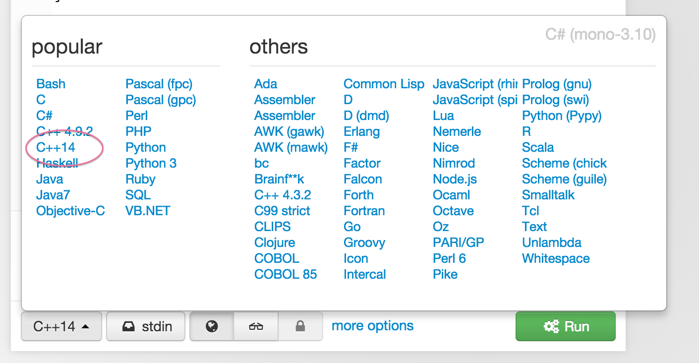
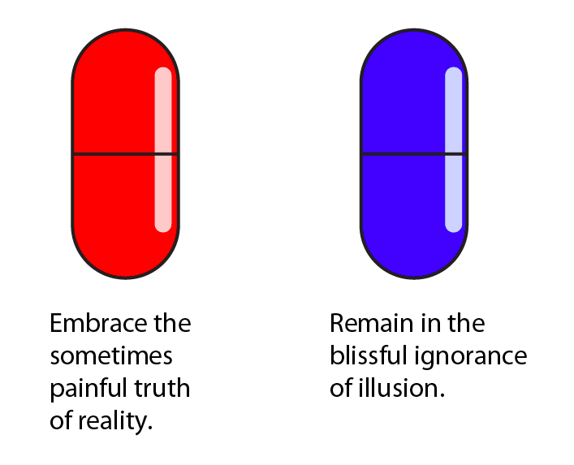

# C++ 语言基础

*作者 [Josh Nimoy](http://jtnimoy.net)*

>
> 未来的魔术师将会用数学方程式。
>
> **--Aleister Crowley, 1911**

## 生机勃勃!


此文章将介绍大家怎么使用 C++ 语言写出一个电脑程序。也许你的知识可能不够多, 不过你的读写能力将会随着这篇文章提高你的理解,因为它是众多作品的基础以及出发点。除此之外, 这里的教程都会不断升级以及善用之前所学到的一点一滴, 也就是所你不可以跳过任何一个教程主题, 以免跟不上。万一你遇到任何困难或不明白, 请在下一个教程之前寻求帮助。跟随这一系列精密的教学不止可以掌握 openFrameworks 的基础了解, 它还让你了解基本的电脑操作。


## 迭代


我在90年代里做了最多绘画以及粉刷性的艺术作品, 一个高中AP艺术生, 一头翩翩起舞的乌黑马尾, 戴着一副圆框眼镜,穿着一系列使用Liquitex 基本丙烯酸颜料泼, 甩, 点缀, 涂抹的独特衣着。由于我对经济课堂上太不感兴趣, 我利用那段时间尝试了解了TI-82 图形计算器, 然后意外的发现一些非比寻常的事情。不像我家里的小计算机, TI-82有一本很厚的使用手册, 记载的都是一些三角函数以及看似很高端的科学, 此时, 我渴望探索的视线里发现了一个性感的黑色三角形在白色作为背景的情况下, 发现了好多往上下不懂排列的三角型在里面, 正如图1显示。


这个分形是有名的 [谢尔宾斯基三角形](https://www.wolframalpha.com/input/?i=sierpinski+triangle), 基本上用了25个电脑指示来完成的谢尔宾斯程序. 我仔细的看了当中的代码, 发现了几个 numeric operations, 个人觉得不会太难, 大致上都是 “do this” 或者 “if something then do another thing” 的命令字眼。我照着书里的代码写进图形计算器, 然后实行那个程序。刚开始 LCD 潘饿了完全没显示任何东西。慢慢的, 有几个像素开始随机转黑色。此时还太随机, 看不到任何形状, 不过再过多几秒, 荧幕上逐渐地看到三角形的痕迹。再经过一段时间, 我的计算机呈现了和书里一摸一样的图像。此时的我完全被这个结果惊呆了。怎么想也想不通, 这是什么奇迹啊, 采用了这么少指示就可以获取这么复杂的成果了吗？此荧幕有多于六千个像素, 我只是用了仅仅25个指示就得到了这么赞的－作品。我可以从中参考以及改变成一个新作品吗？我从来没有想过这么神奇的结果背后尽然只有一点指示。的此时我找到了人生新的目的, 我得了解这个程序, 因为它在我的定义里已经是非常重要的一部分了。于是, 我尝试改变了里面的一些数值再从新实行此程序。这时, 荧幕上还是呈现白色背景, 不过这次的图形截然不同了, 而且这次的构图渐渐的往左边移动, 一直到黑色像素完全离开荧幕里。这下我更大胆了, 我直接把一个英语指示给换掉, 然后这个程序出现错误, 无法实行了。


图2所示的是一个无限重复的循环, 我已经非常高兴地实践了几十年, 但我仍热衷于此。 每个新的周期永远不会让我惊讶。 当我追求创建一个程序的意义, 以及创建软件艺术的意义。 迭代演化计算机指令列表的过程总是呈现出与艺术奖励一样的逻辑挑战。 几乎没有挑战是不可能解决的, 特别是可以和其他人协作及相互帮助时, 或者通过将我的难题分裂成更小的问题。 如果你已经在另一个编程环境中编写过代码, 如 Processing, Javascript, 或者甚至 HTML 和 CSS, 那么这第一个重要的课程可能很直接。


对于那些刚刚熟悉了写小程序意味着什么的人, 重要的是要理解代码编写过程的迭代性质。图3中的轶事显示了什么是这个过程的 *错误理解*。你不可能只一次性得把代码敲进编辑器, 然后按下编译键并看到你完成的结果。这过程是自然的, 并且几乎都是从小程序开始, 有大量的错误(Bugs), 并缓慢地向期望的结果或行动的目标发展。事实上, 前面的假设是一个彻底的程序员的错误, 这是很常见的。即使在古早的时候, 程序是手写在纸上, 作者仍然需要痴迷扫读代码, 以找出错误, 因此该过程是迭代渐进的。在学习 C++ 语言时, 我将提供一些小代码示例, 您可以在您的机器上进行编译。不同的是把书中的代码输入到编辑器, 然后(如果你的手指不滑)程序将会神奇地运行。我故意删除故障排除经验, 以便隔离 C++ 语言本身的主题。然后, 我们将处理最常见的任务 *调试*(修复错误)。

## 编译我的第一个程序


让我们从最小, 最直接的 C++ 程序开始, 然后使用方便的环境来测试本章的小代码片段。为了做到这一点, 我们必须要有一个 *编译器*, 这是一个程序, 将一些代码转换为一个实际的可运行的应用程序, 有时被称为可执行文件。 C++ 的编译器大多可以免费下载, 在很多时候是开源的。我们生成的应用程序不会自动显示在苹果的 App Store, Google Play, Steam, Ubuntu Apps Directory 或 Pi Store 等地方。相反, 它们是你的个人私人程序文件, 你随后可以手动共享它们。在下一章 *oF设置和项目结构* 中, 编译器将位于本地计算机上, 能够离线运行。现在, 我们将不耐烦, 并使用Sphere研究实验室的一个方便的工具在网络上编译一些随意的 C++。请打开您的网络浏览器并转到[ideone](http://ideone.com)(http://ideone.com)。


你会立即注意到有一个编辑器已经包含一些代码, 但它可能设置的是另一种语言。 如果它不是 C++ 模式的话, 让我们把语言切换到 C++ 14。 在编辑器左下角, 按下 "stdin" 左边的按钮, 如图4所示。此按钮的标签可以是任何显示的语言。


菜单的下拉列表有许多编程语言。 请选择 C++ 14, 如图5所示。




请注意编辑器中的代码的变动, 看起来像图6。


这只是一个空代码模板, 没有任何作用, 也不创建产生错误。 左侧槽中的数字表示代码的行号。 按标有 *Run* 的绿色按钮。 您将在注释中看到代码 “Success” 的副本, 标有 *stdin*(标准输入)的部分将为空。 *stdout*(标准输出)也将为空。


### 字体排版的小插曲


网络上的大多数字体都是可变宽度的, 意味着字母宽度不同, 阅读起来非常舒适。 字体也可以是固定宽度的, 意味着所有的字母(即使是W和小写字母i)是相同的宽度。 虽然这可能看起来有趣, 像打字机一样土气, 但是它服务于一个重要的目的。 固定宽度的字体使一块文本像一块游戏板, 或像棋子或图形纸。 计算机编程代码通常以固定宽度排版呈现, 因为它是 ASCII-art 艺术的一种形式。 缩进, 空格字符和重复模式都是很重要的, 以便于阅读和比较代码。 每个我认识的除了艺术家Jeremy Rotsztain之外的程序员, 都使用某种方式的等宽字体为他们的代码字体。 这里有一些字体建议: Courier, Andale Mono, Monaco, Profont, Monofur, Proggy, Droid Sans Mono, Deja Vu Sans Mono, Consolas 和 Inconsolata。 从现在起, 你将看到字体样式切换到 `this inline style (内联样式)` 。。。

```cpp
and this style encased in a block . . .
```

。。。这意味着你在看代码。


### 注释


现在请按代码编辑器左上角的 *Edit* 按钮(图7)。


您将看到一个略有不同的编辑配置, 但相同的模板代码仍然可以在顶部编辑。 我们现在将编辑代码。 找到第5行：

```cpp
// your code goes here .
```

以双斜线开头的行称为注释。 您可以键入任何您需要的, 以便以您理解的方式注释代码。 有时, 通过在代码前放置两个正斜杠来 “注释代码” 是很有用的, 因为它会取消激活 C++ 代码而不删除它。 C++ 中的注释也可以占用多行, 或者像标签一样插入。 开始和结束注释模式的语法不同。 `/ * and the * /` 之间的所有内容都成为注释：

```cpp
/* 
this is a multi-line comment. 
still in comment mode.
*/
```


请删除第5行的代码, 并将其替换为以下语句：

```cpp
cout << "Hello World" << endl;
```

这行代码告诉计算机将 “Hello World” 说成一个称为 *standard output* (aka. *stdout*)的隐含文本空间。 当编写程序时, 需要知道有 *stdout* 的存在。 程序能将文本 "print" 给它。 其他时候, 它只是一个窗口窗格放在在你的编码工具中~~, ~~只用于~~排除故障~~为故障排除 **[t：更好的短语？]**。


你可以把几乎任何东西放在这些引号之间。 引用的短语是文本的调用的 *字符串*。 更具体地说, 它是一个 *c-string literal* 字符串。 我们将在本章的后面更多地介绍字符串。 在代码中, 块 `cout <<` 部分意味着“以格式化的方式向stdout发送以下内容”。 最后一个块 `<< endl` 意思是“在 helloworld 消息的结尾处添加一个回车符(end-of-line)”。 最后, 在这行代码的最后, 你会看到一个分号(;)。


在 C++ 中, 分号就像句子末尾的句号或句号。 我们必须在每个语句之后键入一个分号, 通常这是在代码行的结尾。 如果忘记键入该分号, 编译将失败。 分号是十分有用的, 因为它们允许多个语句共享一行, 或单个语句占用多行, 释放程序员灵活和表达与一个空格。 通过添加分号, 您可以确保编译器不会混淆：您帮助它, 并显示它在语句结束的地方。 当第一次学习 C 或 C++ 时, 忘记分号可能是一个非常常见的错误, 但是有必要对代码进行编译。 请特别注意确保您的代码语句以分号结尾。


当你打字时, 也许你注意到文本本身变成了多色。这个方便的功能称为 *syntax-coloring*(或语法高亮), 并且可以潜意识地增强读取代码的能力, 解决格式错误的语法, 并协助搜索。每个工具都有自己的语法着色系统, 所以如果你想改变颜色, 请期望它不仅仅是一个文字处理器, 它的颜色是你自己添加到文档的东西。代码编辑器不会让我将一个发光的水色颜色的字体“TRON.TTF”分配给*只是*`endl`(这意味着行尾)。相反, 我可以为整个类别的语法选择一种特殊的风格, 看到我的代码样式的所有部分, 只要它是那种类型的代码。在这种情况下, `cout`和`endl`都被认为是关键字, 所以工具将它们变成黑色。如果这些东西在其他地方显示为不同的颜色, 请相信它是和以前一样的代码, 因为不同的代码编辑器提供不同的语法着色。整个代码现在应该看起来像这样：

```cpp
#include <iostream.h>
using namespace std;

int main(){
	cout << "Hello World" << endl;
	return 0;
}
```


现在按下右下角的绿色	*ideone it* 按钮, 并观察输出控制台, 它是代码编辑器的下半部分, 就在该绿色按钮的上方。 您将看到橙色状态消息, 如 “等待编译”, “编译中” 和 “运行”。 不久之后, 程序将在云中执行, 标准输出应显示在该网页上。 您应该在图8中看到新消息。


你做了这些。 现在给自己一点勉励。 你刚刚写了你的第一行 C++ 代码; 你分析它, 编译它, 运行它, 并看到输出。


## 超越 Hello World


现在我们已经进入状态了, 让我们回去分析代码的其他部分。 第一行是一个include语句：

```cpp
#include <iostream>
```

与 Java 和 CSS 中的 *import* 类似, `＃include`类似于告诉编译器从文件中该位置处的一个名为 *iostream.h* 的文件中剪切和粘贴一些其他有用的代码, 以便可以依赖于它的代码 在您的新代码。 在这种情况下, iostream.h *提供* `cout` 和 `endl` 作为我可以在我的代码中使用的工具, 只需键入他们的名字。 在 C++ 中, 以 **.h** 结尾的文件名称为头文件, 并且它包含将包含在实际 C++ 实现文件中的代码, 其文件名将以 **.cpp** 结尾。 有许多标准头文件建立在 C++ 中, 提供各种基本服务 - 实际上太多了, 这里就不赘述了。 如果这还不够, 那么在项目中添加一个外部库(包括它的头部)也是很常见的。 您还可以将自己的头文件定义为您编写的代码的一部分, 但语法略有不同：

```cpp
#include "MyCustomInclude.h"
```

在openFrameworks中, 双引号用于包括不属于系统安装的头文件。


### 紧跟着 # 的是什么?


虽然说来话长, 但这是值得理解的概念。 include 语句不是真正的 C++ 代码(注意没有分号)。 它是一个完全独立的编译器传递的一部分, 称为*预处理器*。 它发生在你的实际程序化指令被处理之前。 它们就像代码编译器的指令, 而不是计算机在编译后运行的指令。 在这些*预处理器指令*之前使用 磅(pound) / 哈希(hash) 符号, 可以清楚地在文件中找到它们, 这也是一个重要的原因。 它们应该被视为不同的语言, 与实际的 C++ 代码混合在一起。 并没有太多的 C++ 预处理器指令 - 它们常常用于聚集其他代码。 这里有一些你可能会看到。

`#define`
`#elif`
`#else`
`#endif`
`#error`
`#if`
`#ifdef`
`#include`
`#line`
`#pragma`
`#undef`


让我们做一个实验。 在代码编辑器中, 请注释掉第1行的include指令, 然后运行代码。请在行的开头插入两个相邻的正斜杠, 注释掉代码行。

```cpp
//#include <iostream>
```

语法高亮将变为所有绿色, 这意味着它现在只是一个注释。 通过按右下角的大绿色按钮运行代码, 您将在输出窗格中看到新的内容。

```
prog.cpp: In function 'int main()':
prog.cpp:5:2: error: 'cout' was not declared in this scope
  cout << "Hello World" << endl;
  ^
prog.cpp:5:27: error: 'endl' was not declared in this scope
  cout << "Hello World" << endl;
                           ^
```


编译器发现一个错误, 没有运行程序。相反, 为了帮助你解决它, 编译器指出你的错误代码处。第一部分, *prog.cpp*：告诉你包含错误的文件。在这种情况下, ideone.com 将您的代码保存到默认文件名中。接下来, 它显示`在函数 'int main()'`: 文件中显示包含错误的代码的特定部分, 在这种情况下, 位于 {curly brace} 之间的函数称为 *main*。 (稍后我们将讨论函数和花括号)。在下一行, 我们看到`prog.cpp：5：2：`。 5是从文件顶部开始的多少行, 2是从行开始向右多少个字符。接下来, 我们看到 `error：'cout' 没有在这个范围内声明`。 这是一条消息, 描述它认为在代码中是错误的。在这种情况下, 它是相当正确的。 iostream.h 消失了, 因此没有向我们提供 `cout`, 因此当我们尝试发送 “Hello World” 时, 编译失败。在接下来的几行中, 你会看到一行代码包含了诡异的`cout`, 在它下面的行上还有一个额外的小插入符, 它应该是一个指向代码中的字符的箭头。在这种情况下, 箭头应该位于 `cout` 中的 'c' 下面。系统正在显示您的指令是否有故障。显示第二个错误, 此时, 编译器会报错说没有 endl。当然, 我们知道, 为了修复错误, 我们需要 `include <iostream.h>`, 所以让我们现在修复它。请取消注释第1行, 然后重新运行代码。

```cpp
#include <iostream>
```

当使用 openFrameworks 时, 您可以选择任意工具和平台。 每一种都以不同的方式显示错误。 有时, 编辑器会打开并突出显示您的代码, 放置一个包含更多信息的气泡框。 其他时候, 编辑器将不显示任何内容, 但是编译输出将显示格式类似于上面的原始错误。 虽然有时我们从编译中收到几个错误有时是有用的, 但如果你专注于理解和修复报告的第一个错误, 它可以节省很多的精力。 修复了 top 错误后, 所有后续错误很可能会优雅地消失, 所有的错误都已经由您的第一个修复覆盖。 通过注释掉顶部的单行代码, 我们造成了两个错误。


### 命名空间一览

看到第二行代码, 我们看到:

```cpp
using namespace std;
```

假设您加入了一个社交网站, 并要求您选择用户名。我的名字是Joshua Nimoy - 用户名可能是JNIMOY。我提交页面, 它返回一个错误, 告诉我用户名已经采取, 我必须选择另一个, 因为我的父亲 Joseph Nimoy, 他比我先注册了JNIMOY。所以我必须使用我的中间初始T, 并创建一个唯一的用户名, JTNIMOY。我刚刚创建并解决了一个 *命名空间冲突* *namespace conflict*。命名空间是一组唯一的名称, 即没有一个相同。它可以有相同的名称, 只要它们是两个单独的命名空间的一部分。命名空间帮助程序员避免因为覆盖彼此的符号或篡改彼此的名字而妨碍合作。命名空间还提供一个整洁和整洁的组织系统, 以帮助我们找到我们要找的。在openFrameworks中, 一切都以 `of` 开头。 。 。像 `ofSetBackground` 和 `ofGraphics`。这是一种执行命名空间分离的技术, 因为其他程序员创建的任何其他名称都不太可能以 `of` 开头。 OpenGL使用相同的技术。 OpenGL API(应用程序编程接口)中的每个名称都以`gl`开头, 例如 `glBlendFunc` 和 `glPopMatrix`。然而, 在 C++ 中, 没有必要为您的名称提供严格规范的字符前缀, 因为语言提供了自己的命名空间语法。在第2行中, `using namespace std;` 告诉编译器这个 .cpp 文件将使用 `std` 命名空间中的所有名称。扰流警报！这两个名称是 `cout` 和 `endl`。让我们现在做一个实验, 注释掉第2行, 然后运行代码。你认为编译器会返回什么样的错误？

```cpp
/* using namespace std; */
```

这是一个非常类似的错误, 以前, 它找不到 `cout` 和 `endl`, 但这一次, 有建议替代添加到消息列表。

```
prog.cpp:5:2: note: suggested alternative:
In file included from prog.cpp:1:0:
/usr/include/c++/4.8/iostream:61:18: note:   'std::cout'
   extern ostream cout;  /// Linked to standard output
                  ^
```

编译器说：“嘿, 我搜索了 `cout`, 我在文件中包含的命名空间中找到它, 这里是 `std :: cout` ”, 在这种情况下, 编译器是正确的。 它希望我们使用 `cout` 的方式 *更明确*, 所以我们在左侧表示它的命名空间 `std`(标准), 用双冒号 (::) 连接。 它就像自称为 “Nimoy::Joshua”。 继续我们的实验, 编辑第5行, 为 `cout` 和 `endl` 添加了显式命名空间。

```cpp
std::cout << "Hello World" << std::endl;
```


当你运行代码, 你会看到它的编译就好, 并成功打印 “Hello World”。 甚至说 `using namespace std;` 的行仍然被注释掉。 现在想象你正在编写一个程序来随机生成歌曲的歌词。 显然, 你会使用 `cout` 相当多。 在所有的 `cout` 之前键入 `std ::` 会变得很乏味, 编程语言增加这些特性的原因之一是减少打字。 因此, 尽管第2行 `using namespace std;` 不是必需的, 但是通过隐含的上下文, 将它放在适当位置(与其他 `using namespace` 语句一起)可以保持你的 C++ 代码容易输入和读取。


我参加过曼哈顿的一个拼字游戏派对, 我是唯一叫 Jhon 的。 当我轮到我玩时, 人们可以叫我Josh。 然而, 如果 Jhon Noble 在晚饭后加入我们, 这有点混乱, 我们为了分辨清楚, 同时叫姓和名。 在 C++ 中, 同样也是如此。 我会是 `Nimoy::Josh`, 他会是 `Noble::Josh`。 有两个不同的 `cout` 名称, 一个来自 `std` 命名空间, 另一个来自 `improved` 命名空间, 只要两者都用显式命名空间表示就好了。 `std :: cout` 和 `improved :: cout`。 事实上, 如果你不这样做的话编译会出错。

接下来当我介绍类时, 你会看到更多的双冒号语法 (::)。

## 函数

继续, 让我们看看第4行：

```cpp
int main() {
```

这是具有开始和结束的第一段代码, 使得它 “包裹” 另一段代码。 但更重要的是, 函数 *表示* 包含在其中的语句。 这个 *函数* 的结束端是第7行的结束大括号：

```cpp
}
```

在C ++中, 我们将一组代码语句封装在函数中, 每个函数可以看作是较大程序中的一个小程序, 如图9中的简化图。


每个函数都有一个名字, 我们可以通过名字来调用它。 调用函数是执行该函数中包含的代码语句。 这样做的基本方便是减少打字, 我们稍后将讨论其他优点。 像棋盘游戏一样, 一个程序有一个起始位置。 更确切地说, 程序具有编译器预期的 *入口点*。 该入口点是一个名为 *main* 的函数。 在 *main* 函数中编写的代码是在程序中执行的第一个代码, 因此它负责调用程序中的任何其他函数。 谁调用你的 *main* 函数？ 操作系统！ 让我们在这个演示中分解 main 函数的语法。 再一次, 对于所有你处理编码, 这是老消息。


当定义一个函数时, 第一个指令是通告的返回类型。函数可以选择性地返回一个值, 例如问题的答案, 问题的解决方案, 任务的结果或过程的产物。在这种情况下, *main* 承诺返回一个 `int`, 或者 *integer* 类型, 它是一个没有分数或小数部分的整数。下一个指令是我们的函数的名称。系统期望所有小写字母中的 “main” 一词, 但随后您将定义自己的函数, 我们将进入命名。接下来是开始和结束括号。是的, 它似乎有点奇怪, 它在那里, 因为它里面什么都没有。然后, 我们将看到在那里发生了什么 - 但从来没有遗漏一对括号与函数, 因为在某种程度上, 这是人类的主要暗示, 它是一个函数。事实上, 从现在开始, 当我按名称引用一个函数。当函数不需要参数时, 我将使用一个()函数后缀(例如`main()`), 如果函数需要一个或多个参数的话, 我们就用 `main(...)`。

接下来, 我们看到一个开放的大括号。 有时, 这个打开的大括号与前面的右括号在同一行, 其他时候, 你会看到它在新的一行。 这取决于编码器, 项目或组的个人风格 - 两者都很好。 有关不同缩进样式的完整参考, 请参阅维基百科关于缩进样式的文章(http://en.wikipedia.org/wiki/Indent_style)。

在这个开放的大括号和闭包之间, 我们放置我们的代码语句, 实际告诉计算机去做某事。 在这个例子中, 我只有一个语句, 这是必需的'返回'。 如果你设定这个函数的返回类型是int, 那么编译器会检测你是否返回了一个int。 在这种情况下, 操作系统将0解释为“没有出错”。 尝试一下, 看看当你改变0到1, 会发生什么, 并运行代码。


## 自定义函数

我们将试着定义我们自己的函数, 并将它用作一个字模板。 在编辑器中输入示例代码并运行它。

```cpp
#include <iostream>
using namespace std;

void greet(string person){
	cout << "Hi there " << person << "." << endl;
}

int main() {
	greet("moon");
	greet("red balloon");
	greet("comb");
	greet("brush");
	greet("bowl full of mush");
	return 0;
}
```

这输出展示了一个熟悉的睡前小故事。

```
Hi there moon.
Hi there red balloon.
Hi there comb.
Hi there brush.
Hi there bowl full of mush.
```

在这个新的代码中, 注意第二个函数 `greet(...)`, 它看起来是相同的, 但不同于 `main()`。 它具有相同的大括号来保存代码块, 但返回类型不同。 它有同一对括号, 但这一次里面有一些东西。 那么所需的返回语句呢？ 当函数不返回任何内容时, *void* 关键字用于替换返回类型。 所以, 因为 `greet(...)` 有一个 *void* 返回类型, 编译器不会抱怨, 如果你省略 `return`。 在括号中, 你看到 `string person`。 这是一个参数, 是要使用的函数的输入值。 在这种情况下, 它有点像查找和替换。 在 `main()` 中, 你看到我调用 `greet(...)` 五次, 每次我在括号之间用不同的字符串引用。 那些是 *参数*。

另外, 为了帮助辨别何时调用 *参数* 和何时调用 *参数*, 请参见此代码示例：

```cpp

void myFunction(int parameter1, int parameter2){
	//todo: code
}

int main(){
	int argument1 = 4;
	int argument2 = 5;
	myFunction(argument1,argument2);
	return 0;
}

```

回到前面的例子, 这五行代码都是 ***函数调用***。 他们告诉 `greet(...)` 执行, 并传递一个字符串参数, 所以它可以做它的工作。 一个字符串参数通过名为 `person` 的参数提供给 `greet(...)` 的内部代码。 要查看事件的发生顺序, 请参见图11。


图11中的彩色线是由虚拟的播放头绘制的路径, 其在代码执行时跨越代码。我们从蓝色部分开始, 通过主入口点进入, 然后遇到 `greet(...)`, 这是一个 *jump* 发生的地方。当线变成绿色时, 它临时从 `main()`中逃出来, 所以它可以沿着 `greet(...)` 一段时间。关于该行变成黄色的位置, 您会看到它在 `greet(...)` 中执行了包含的代码, 然后执行第二次跳转(返回), 此时返回到上一个保存的地方, 继续执行下一条语句。在这个例子中我们可以看到的最明显的优势是将复杂性从这个长的 `cout` 语句减少到一个简单的调用 `greet(...)`。如果我们必须调用`greet(...)`五次, 将例程*封装*为一个函数, 这就给了它方便的权力。假设您想将问候语从“晚安”改为“显示结束”。而不是更新你剪切和粘贴的所有代码行, 你可以只编辑一个函数, 并且函数的所有使用将以同步方式改变它们的行为。此外, 代码可以变得相当复杂。它有助于将其分解为小例程, 并在考虑如何构建更大的软件时将这些例程作为您自己的自定义构建块。通过使用函数, 你被解放出来, 需要精心地表示你系统中的每一个细节, 因此一个函数是一种*抽象*, 就像在艺术中的抽象。这种抽象称为*复杂性的封装*, 因为它像把大的复杂的东西放在一个漂亮的小盒子里, 使得这个复杂的东西看起来更小更简单。这是一个非常有力的想法 - 不只是在代码中。


## 复杂性的封装

想象一下演员 Laurence Fishburne 穿着有色眼镜, 为你提供两个相当复杂的选项来解释。 一方面, 他愿意帮助你逃离邪恶的矩阵, 以便你可以完成你作为黑客英雄的命运, 但它涉及生活的生存条件, 这是潜在的痛苦, 但无论如何。 故事必须继续, 顺便说一句, 有一个漂亮的女孩。 另一方面, 他也愿意让你忘记这一切发生, 神秘地把你种在你的小公寓里, 你可以生活在谎言里, 不需要智慧。 这两个选项在电影 *黑客帝国* 中解释, 然后主要字符提供彩色药片的形式的选择, 作为一种方式来简化否则冗长的电影场景。 两个复杂的选择被封装成一个简单的类比, 这对电影观众来说更容易吞下。 参见图12。




不是重复整个复杂的情况, Neo(主角)只需要吞下一个药丸。即使它是真正的医学, 封装复杂性的想法仍然适用。我们大多数人没有以最有效的方式实践医学的专业知识, 因此我们相信医生和药理学家创造恰到好处的恰当的草药和化学品的混合。当你吞下药丸, 它就像调用这个函数, 因为你有优势, 不需要了解药丸的专业深度。你只是相信丸会导致结果。代码也是如此。大多数时候, 一个函数是由别人写的, 如果那个人是一个好的开发者, 只要你掌握如何正确调用函数, 你就可以自由地保持对函数的内部工作的无知。这样, 你就是 *高层级* 的程序员, 意味着你只需调用函数, 但你没有写它。在 openFrameworks 中创建项目的人基于 openFrameworks 的基础上。 openFrameworks 基于 OpenGL 实用工具包的基础之上, 它基于 OpenGL 本身, 等等。换句话说, openFrameworks 项目是 C++ 的一个更高级别的 *应用程序*。一种具有*低层级*编程声誉的语言。如图13所示, 当我告诉人们我用 C++ 编写了一个交互式文章时, 我有时会遇到这样一个问题。


使用 C++ 比其他选项 (主要是脚本) 为您的新媒体项目提供一些优势。 在那些知道细节的人中, 讨论可以相当宗教 (读作：狂热)。 如果你试图学习 C++, 通常是因为你寻求更快的运行时性能, 因为 C++ 有更多的库, 你可以捕捉到你的项目, 或者因为你的导师在使用这种语言。 OF 项目被认为是更高级别的, 因为它做的是更大的复杂性封装工作, 这也是值得自豪的一点。


## 变量 (第一部分)

> 
> 事物即思考, 即思想的联合。
> 
> -- Alan Watts


请输入下面的程序到 ideone 里并编译它。

```cpp
#include <iostream>
using namespace std;

int main(){
	cout << "My friend is " << 42 << " years old." << endl;
	cout << "The answer to the life the universe and everything is " << 42 << "." << endl;
	cout << "That number plus 1 is " << (42+1) << "." << endl;
	return 0;
}
```

输出看起来应该是这样:

```
My friend is 42 years old.
The answer to the life the universe and everything is 42.
That number plus 1 is 43.
```

从上一课我们可以理解, 在 `<<` 运算符之间放置的东西将被格式化为 `cout` 对象, 并且神奇地出现在输出控制台中。 注意在最后一行, 我把一点点算术 (42 + 1) 在括号之间, 它计算成43。在数学意义上, 这被称为 *表达式*。 这三行代码都是关于数字42的, 所以它们都包含一个 *字面* 整数。 字面值是直接键入代码的内容, 也被称为“硬接线”, 因为一旦它编译完成, 其值是固定的。

如果我想改变那个数字, 我可以做我知道从文字处理, “查找和替换”给 42 一个新的值。 但现在如果我在3D世界中有100,000颗粒子。 又一些42s需要改变, 但其他42s不应该改变？ 当你编写代码时, 事情会变得沉重和复杂。 *变量* 最明显的应用是它们是一个非常强大的查找和替换机制, 但是你会看到变量不仅仅在这方面有用。 所以让我们在代码的顶部声明一个整数, 并使用它代替文字42。

```cpp
#include <iostream>
using namespace std;

int main(){
	
	int answer = 42;
	
	cout << "My friend is " << answer << " years old." << endl;
	cout << "The answer to the life the universe and everything is " << answer << "." << endl;
	cout << "That number plus 1 is " << (answer+1) << "." << endl;
	return 0;
}
```

现在我使用的变量 `answer`, 我只需要改变一个数字在我的代码, 它将显示在所有三个句子为42。这可能比寻找和替换更优雅。 图18显示了在同一行上声明和初始化变量的语法解释。


也可以声明一个变量并在两个单独的行上初始化它。 它看起来像：

```cpp
int answer;
answer = 42;
```

在这种情况下, 在您声明该变量后, 有一个时刻, 当它的答案可能是不可预测的和故障, 因为在 C (不像 Java), 新的变量没有自动设置为零 - 你需要这样做。 如果你不这样做, 变量可以得出不可预测的值 - 计算机内存 - 就是从过去的垃圾。 所以, 除非你打算制作故障艺术, 否则在声明它时, 请始终初始化一些数字, 即使这个数字是零。


### 给你的变量命名


注意下面的箭头说 “必须是有效的名称”。 我们发明了新的名字来给我们在代码中定义的命名空间, 函数, 变量和其他结构 (类, 结构, 枚举和其他我没有教过的东西)。 在代码中定义新标识符的规则与在网站上选择密码类似的方式是严格的。

+ 您的标识符只能包含字母, 数字和下划线。
+ 它不能以数字开头, 但它肯定可以以下划线开头。
+ 该名称不能与语言关键字相同(例如, 单词“void”)

以下标识符是合格的。

```
a
A
counter1
_x_axis
perlin_noise_frequency
_         // a single underscore is fine
___       // several underscores are fine
```


注意小写字母 a 是与大写字母 A 不同的标识符。C++ 中的标识符区分大小写。
以下标识符不正确。

```cpp
1infiniteloop         // should not start with a number
transient-mark-mode   // dashes should be underscores
@jtnimoy              // should not contain an @
the locH of sprite 1  // should not contain spaces
void                  // should not be a reserved word
int                   // should not be a reserved word
```

命名你的变量 `void_int`, 虽然令人困惑, 但不会导致任何编译器错误, 因为下划线将两个关键字连接到一个新的标识符。 偶尔, 你会发现自己遇到了 `unqualified id` 错误。 这里是一个 C++ 保留关键字的列表, 以避免在命名变量时。 C++ 需要它们, 以便它可以提供一个完整的编程语言。

```
alignas alignof and and_eq asm auto bitand bitor bool break case catch
char char16_t char32_t class compl const constexpr const_cast continue
decltype default delete do double dynamic_cast else enum explicit
export extern false final float for friend goto if inline int long
mutable namespace new noexcept not not_eq nullptr operator or or_eq
override private protected public register reinterpret_cast return
short signed sizeof static static_assert static_cast struct switch
template this thread_local throw true try typedef typeid typename
union unsigned using virtual void volatile wchar_t while xor xor_eq
```


### 命名组件

>
> 语言和习惯的不同是微不足道的, 如果我们的目标是想通的, 并保持开放的心态。
> 
> **--Albus Dumbledore**

标识符 (包括的变量) 用不同的样式写成, 以指示它们的各种属性, 例如结构类型 (变量, 函数或类？), 数据类型 (整数或字符串？), 范围 隐私等。你可能会看到一些标识符在开头大写, 并使用 `CamelCase`, 而其他仍然是`lower_case_using_underscores_to_separate_the_words`。 发现全局常量使用 `ALL_CAPS_AND_UNDERSCORES` 命名。 另一种做小写命名的方法是从小写字母 `letterThenCamelCaseFromThere` 开始。 你也可能看到一个混合版本, 如 `ClassName__functionName__variable_name`。 这些不同的样式可以指示不同类别的标识符。

更强调的是, 程序员有时可能会使用亲切的昵称 *匈牙利语符号*, 向标识符添加字符来说明事情, 但也会降低可读性, 例如 `dwLightYears`和 `szLastName`。 命名约定不是一成不变的, 当然不是由编译器强制执行的。 合作者通常需要就这些微妙的命名约定达成一致, 以使它们不会相互混淆, 并且要求每个人都遵守规则, 以便与惯例保持一致。 代码中的命名约定的主题仍然是开发者之间的热烈争论, 就像决定使用大括号的那一行, 以及是否使用制表符缩进。 像编程中的很多东西, 有人总是会告诉你你做错了。 但这并不一定意味着你做错了。


### 改变变量


我们称之为变量, 因为它们的值在运行时可以*变化*。 他们是最有用的容器, 我们把东西 (比如水) 安全保存。 正如通常那样, 我们最后回到桶, 使用一些水, 或者将化学品混入水中, 或者用更多的水补充到桶里等。变量就像一个空桶, 你可以放置你的东西。 图19显示了游戏 *Minecraft* 中的一个桶。


如果一个计算机程序像一个小脑子, 那么一个变量就像一个基本的记忆单元。 在我的写生簿中记下一个小笔记就像将一个值存储到一个变量中以供以后使用。 让我们看一个变量改变它的值的例子。

```cpp
#include <iostream>
using namespace std;

int main(){
	int counter = 0;
	cout << counter;
	counter = 1;
	cout << counter;
	counter = 2;
	cout << counter;
	counter = 3;
	cout << counter;
	counter = 4;
	cout << counter;
	counter = 5;
	cout << counter;
	return 0;
}
```

输出的值应为 `012345`。 注意使用等号。 它不同于我们习惯的算术。 在传统上下文中, 单个等号意味着两侧的表达式将被评估为相同的值。 

在 C 语言中, 这实际上是一个双等号(==), 我们将在以后讨论。 单个等号表示“解答右侧的表达式并将答案存储到左侧命名的变量中”。 如果你以前没有编程, 需要慢慢习惯。 如果我是一个初学的程序员(假装我内心永远像个孩子), 我可能会喜欢一些替代语法命令计算机存储一个值到一个变量。 在普林斯顿声音实验室开发的语言 *ChucK* 中发现的某些东西: `3 => counter`, 或者可能是一些更加直观的东西, 就像我在图20中的 Minecraft 工艺表一样。


变量名的可用性体现在左侧而不是右侧的属性在实践中变得明显, 因为表达式可能会相当冗长！ 用 `varname =` 开始一行会更容易让眼球扫描, 因为它保证有两个符号长, 然后才开始计划在等号后输入的任何疯狂的值。

分析前面的代码示例, 我们看到数字在输出之前每次增加1。 我反复存储文本整数到变量。 由于编程语言知道基本算术, 现在让我们尝试以下修改：

```cpp
#include <iostream>
using namespace std;

int main(){
	int counter = 0;
	cout << counter;
	counter = counter + 1;
	cout << counter;
	counter = counter + 1;
	cout << counter;
	counter = counter + 1;
	cout << counter;
	counter = counter + 1;
	cout << counter;
	counter = counter + 1;
	cout << counter;
	return 0;
}
```

输出仍应为 `012345`。 通过写出 `counter = counter + 1`, 我将 `counter` 增加 1 更具体地说, 我在右边的“加法”表达式中使用 `counter`, 并且结果(一会儿之后)被存储进了 `counter`。 这似乎有点意思了, 因为它在两个不同的时间谈论 `counter`。 它让我想起了电影系列, *回到未来*, 其中 Marty McFly 遇到过去和未来的版本的自己。 参见图21。


伟大的 Scott, 这可能让某些人懵了！ 但是做了几次后, 你会发现它不会比你看到的复杂很多。 这是一个高度*实用*的科幻小说的做法, 你可能不是试图挑战时空的结构(除非你是 Kyle McDonald, 或者也许是一个 Haskell 程序员 <!-- 我的意思是这是高级别的, 不是嘲弄 -->)。 这里的要点是修改计算机内存的内容, 所以我们有一个指令前面的 `counter`, 就像我们去加水一样。 图22显示了 `bucket = bucket + water`。


增加一个, 或者添加一些值到变量在所有的编程中是非常常见的, 甚至有语法糖。 *Syntactic Sugar* 是为了方便起见而添加到编程语言的冗余语法。 它有助于减少打字, 可以增加理解或表达力, (如糖)使程序员更快乐。 以下语句都将 1 添加到 `counter`。

```cpp
counter = counter + 1; // original form
counter += 1;          // "increment self by" useful because it's less typing.
counter++;             // "add 1 to self" useful because you don't need to type a 1.
++counter;             // same as above, but with a subtle difference.
```

Let's test this in the program.

让我们测试一下。

```cpp
#include <iostream>
using namespace std;

int main(){
	int counter = 0;
	cout << counter;
	counter++;
	cout << counter;
	counter++;
	cout << counter;
	counter++;
	cout << counter;
	counter++;
	cout << counter;
	counter++;
	cout << counter;
	return 0;
}
```

是的, 这减少了很多字数, 有很多方法, 使其更简洁。 这里有一种方法。

```cpp
#include <iostream>
using namespace std;

int main(){
	int counter = 0;
	cout << counter++;
	cout << counter++;
	cout << counter++;
	cout << counter++;
	cout << counter++;
	cout << counter++;
	return 0;
}
```

答案仍然是“012345”。 即使它位于表达式内, 后缀增量操作符也将增加变量。 现在让我们尝试前缀版本。

```cpp
#include <iostream>
using namespace std;

int main(){
	int counter = 0;
	cout << ++counter;
	cout << ++counter;
	cout << ++counter;
	cout << ++counter;
	cout << ++counter;
	cout << ++counter;
	return 0;
}
```

如果你得到答案 `123456`, 这是正确的！ 前缀增量运算符与其后缀姐妹不同。 在计数器初始化为0的情况下, `++ counter` 将计算为1, 而 `counter ++` 仍将计算为0 (但是计数器的增量版本将留作后来使用)。 以下示例的输出为 `1112`。

```cpp
#include <iostream>
using namespace std;

int main(){
	int counter = 0;
	cout << ++counter; // 1: increments before evaluating
	cout << counter;   // 1: has NOT changed.
	cout << counter++; // 1: increments after evaluating
	cout << counter;   // 2: evidence of change.
	return 0;
}
```

为了算术的完备性, 减法 *decrementing* (*减量*) 运算符 (counter--) 也是存在的。 另外, 你现在可能已经猜到, 如果一方面可以写 `counter + 1`, 那么C编译器也会识别其他经典算法, 如 `counter-3` (减法), `counter * 2` (乘法), `counter / 2` (除法), 并通过使用括号来重写操作的顺序, 例如 `(counter + 1) / 2` 计算结果与 `counter + 1 / 2` 不同。 在变量之前放一个负号也会做正确的事情, 否定它, 就好像它被从零减去一样。 C 使用布尔逻辑和按位操作扩展了数学运算符的基本架构; 我将在变量第2部分中介绍它们。

还有一些更多的要点来了解变量, 但我们将采取我们迄今为止学到的, 并以乐趣的名义去运行它。 在此期间, 给自己一点鼓励, 毕竟已经看了这么多了！ 你学习了什么是变量, 以及如何对它们执行基本算术。 你还学习了放在变量名之前和之后的 ++ 操作符的作用以及他们的不同。

C++ 语言的名称是从从 C 语言加一而来。

## 总结

恭喜您完成本 C++ 简介的前几页。有了这些基本概念, 你应该能够自己探索很多, 但我承认, 这还不足以让你理解本书其余部分的代码示例。由于纸张资源有限, 您在这里看到的是一个“前导”章节, 用于对 C++ 语言进行必要的更长的介绍。这个版本的本章变得如此之大, 以至于它现在自成一本书了 - 在网络上可以毫无瑕疵地, 可能在未来作为本书的伴随书。将 C++ 语言教给非程序员确实是一个很大的课题, 它本身无法有效地集中到35页, 更不用说100+的页面书。如果你真的想进入 openFrameworks, 我强烈建议你在继续读书之前阅读本章的未修订版本, 这样你就可以理解你正在阅读的内容。你可以在这里这些材料[这里](https://github.com/openframeworks/ofBook/blob/master/chapters/cplusplus_basics/unabridged.md)

## 附上.

Stopping the chapter here is by no means intended to separate what is important to learn about C++ from what is not important. We have simply run out of paper. In lieu of how important the rest of this intro to C++ is, and based on ofZach's teaching experience, here is more of what you'll find in the unabridged version:

停止这里的章节绝不是意在分离什么是重要的, 而是从什么是不重要的开始了解 C++。 我们只是有字数限制。 代替这个介绍 C++ 的其余部分是多么重要, 并基于 Zach 的教学经验, 你会在未删节的版本里学到更多一下内容：

+ 变量存在不同的时间段 - 有些是长时间, 有些是程序的生命周期中的小片段。 *范围*的主题在本书的未减损版本中标题为*变量(第2部分)*。

+ 变量具有*数据类型*。 例如, 一方面保存一个数字, 而另一方面保存一些文本。 更多关于*基本类型*。

+ 重要的是要重申, 与Processing不同, 变量不一定从零开始。 你必须用你想要的值初始化他们, 否则没有告诉你会在那里等你。 你将在数组的介绍中找到关于这种现象的更多讨论。

> 
> 预测未来的最佳方式就是去创造它。
> 
> **--Abraham Lincoln**
