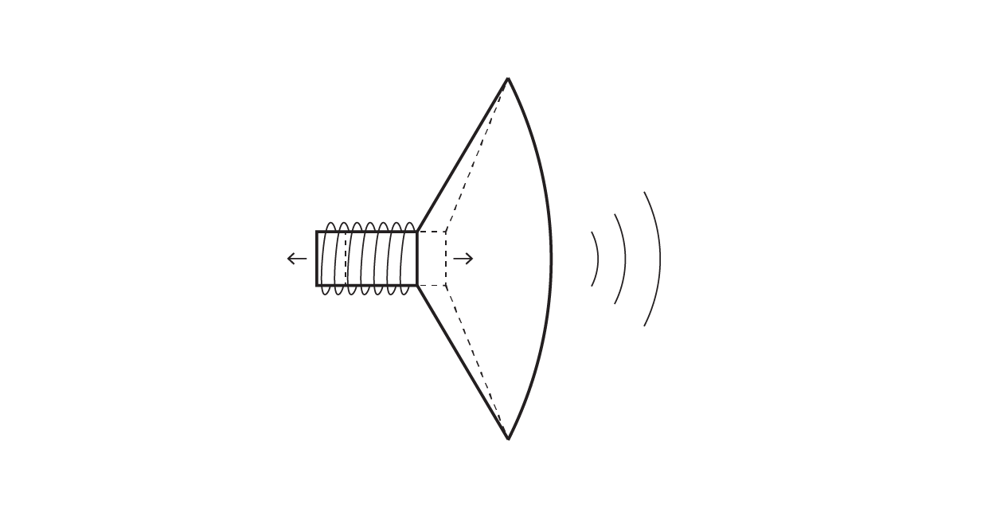
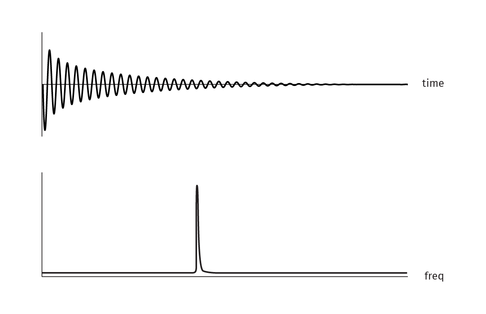
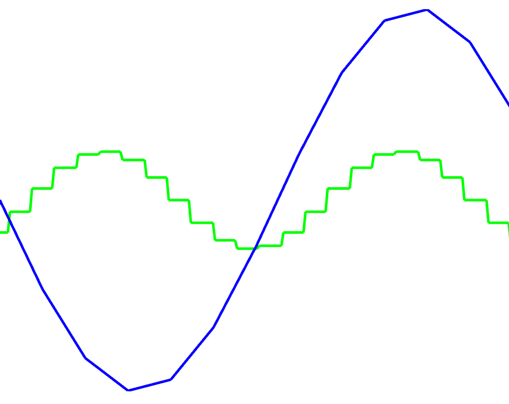
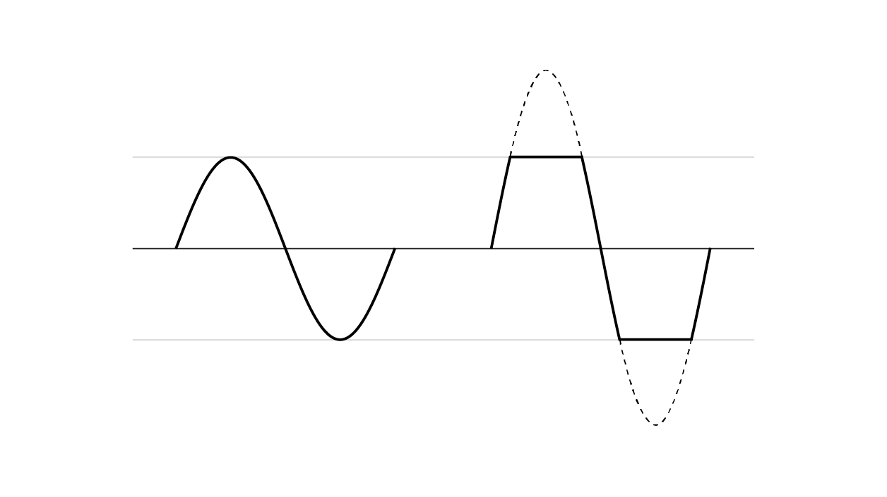

# 声音

*作者 [Adam Carlucci](http://adamcarlucci.com)*

本章将示范如何使用你将在openframeworks中找到的声音功能，以及你可以用来生成和处理声音的一些技术。

下面是在openFrameworks中可以用来处理声音的类的简要概述：

`ofSoundPlayer`提供对声音文件的简单访问，允许你轻松加载和播放声音，添加音效到应用程序，并且在文件播放时提取其声音的一些数据。

`ofSoundStream`提供你访问计算机声音硬件的权限，允许你生成自己的声音，以及对从麦克风或线路输入插孔等进入你的计算机的声音做出反应。

`ofSoundBuffer`用于存储音频采样序列，并对所述采样执行音频相关的功能（如重采样）。 这是openFrameworks 0.9.0中的新功能。

## 声音文件入门

在openFrameworks中，播放声音文件只需几行代码。只要将一个`ofSoundPlayer`指向存储在应用程序的数据文件夹中的文件，并让它播放。

```cpp
class ofApp : public ofBaseApp {
  // ... other things ...
  ofSoundPlayer soundPlayer;
};

void ofApp::setup() {
  soundPlayer.loadSound("song.mp3");
  soundPlayer.play();
}
```

这可以为你的应用程序添加一些背景音乐或环境音效，但ofSoundPlayer还有一些额外的对于处理音效特别方便的功能。

“Multiplay”允许你同时多次播放一个文件。这对于任何由于迅速触发而可能导致结束的音效来说是很棒的，这样你就不会因为播放器的播放头突然跳回到文件开头而产生一个不自然的中断。默认情况下Multiplay是不开启的。用`soundPlayer.setMultiPlay（true）`来启用它。然后你就可以用非常简单的触发逻辑来得到自然的声音效果，如下：

```cpp
if ( thingHappened ) {
  soundPlayer.play();
}
```

ofSoundPlayer内置的另一个功能是速度控制。 如果你设置的速度比正常快，声音的音调会相应地上升，反之亦然（就像一个黑胶唱片）。播放速度是相对于“1”定义的，因此“0.5”是其一半的速度，“2”是双倍速度。

速度控制和多重播放是相互作用的。同时使用两者可以真正延长单个音效文件的寿命。当多重播放启用时，每次你改变一个声音播放器的速度，之前触发的音效会不受影响地继续播放。因此，通过将上述触发逻辑扩展为类似...

```cpp
if( thingHappened ) {
  soundPlayer.setSpeed(ofRandom(0.8, 1.2));
  soundPlayer.play();
}
```

...你将会赋予每个声音一点独特的特征。

ofSoundPlayer的另一大特点是可以对频谱进行简单的的访问。在桌面平台上，你可以使用ofSoundGetSpectrum（）来获取来自应用程序中所有当前活跃的ofSoundPlayers的声音的*频域*表示。本章稍后会对频域进行解释，但是通过运行openFrameworks * soundPlayerFFTExample *，你会明白它的大致意思。

总的来说，ofSoundPlayer是易用性和控制之间的权衡。你可以访问多重播放和音调偏移播放，但你不能获得非常精确的控制或访问声音文件中的单个样本。对于这个级别的控制，ofSoundStream是这方面的工具。

## 声音流入门

ofSoundStream是连接你计算机上的音频硬件的途径，例如麦克风和扬声器。 如果你想让你的应用程序对实时音频输入做出反应或者实时生成声音，这个章节可以帮助你！

你可能不必直接使用ofSoundStream，但它是在应用程序上用于触发`audioOut（）`和`audioIn（）`所需资源的管理者对象。这两个函数在你的ofApp中是可选择使用的，如`keyPressed（）`，`windowResized（）`和`mouseMoved（）`。一旦你执行这些函数并启动声音流，它们将开始被调用。下面是一个产生声音的openFrameworks应用程序的基本结构：

```cpp
class ofApp : public ofBaseApp {
  // ... other things ...
  void audioOut( float * output, int bufferSize, int nChannels );
  double phase;
};

void ofApp::setup() {
  phase = 0;
  ofSoundStreamSetup(2, 0); // 2 output channels (stereo), 0 input channels
}

void ofApp::audioOut( float * output, int bufferSize, int nChannels ) {
  for(int i = 0; i < bufferSize * nChannels; i += 2) {
    float sample = sin(phase); // generating a sine wave sample
    output[i] = sample; // writing to the left channel
    output[i+1] = sample; // writing to the right channel
    phase += 0.05;
  }
}
```

当产生或接收音频时，其格式是-1和1之间的浮点数（其原因稍后被会在本章中阐述）。 声音将以*buffers*的形式传送至你的应用程序。缓冲存储器（buffers）只是数组（arrays），但是缓冲器（buffer）这个术语意味着你每次会获得一个新的缓冲器，它代表了上一个缓冲器之后的一段时间。openFrameworks要求使用缓冲存储器（buffers）（而不是单个样本）的原因是将数据从应用程序传输到音频硬件所需要的开销，并且这超出了本书的范围。

缓冲器（buffer）的大小是可调整的，但通常情况下将它设置成默认值就可以。这个默认值不是特别的数字，但通常取决于你的计算机硬件。实际上，每个缓冲器可能大约有512个样本（256和1024是其他通用的缓冲器大小）。

openFrameworks中的声音缓冲器是*相互交织的（interleaved）*，这意味着每个通道的样本彼此相邻，比如：

```
[Left] [Right] [Left] [Right] ...
```

这意味着你访问单个声道的方式与访问一个ofPixels对象中不同颜色的方式十分相同（即左声道为`buffer[i]`，右声道为`buffer[i + 1]`）。你在`audioIn()` / `audioOut()`获取的缓冲器的总大小可以用`bufferSize * nChannels`来计算。

在处理ofSoundStream时，要特别注意的是音频回调，如`audioIn()`和`audioOut()`将和标准的`setup()`，`update()`，`draw()`函数区分开，用一个单独的*线程（thread）*去调用。这意味着如果你想在（例如）`update()`和`audioOut()`之间共享任何数据，你需要使用`ofMutex`来保持两个线程不会相互影响。本章稍后会有实例，或者你可以查看线程章节以获得更深入的解释。

在openFrameworks 0.9.0中，有一个新的类*ofSoundBuffer*可代替`float * output, int bufferSize, int channels`，在`audioOut()`中使用。在这种情况下，上面的`audioOut()`函数可以写成更简单的形式：

```cpp
void ofApp::audioOut(ofSoundBuffer &outBuffer) {
	for(int i = 0; i < outBuffer.size(); i += 2) {
		float sample = sin(phase); // generating a sine wave sample
		outBuffer[i] = sample; // writing to the left channel
		outBuffer[i + 1] = sample; // writing to the right channel
		phase += 0.05;
	}
}
```

## Why -1 to 1?
## 为什么是-1到1？

为了理解openFrameworks*为什么*选择用-1到1的`float`值这样一个连续流来表示声音，先了解声音在物理层面是如何产生的会很有帮助。



从最基本的层面来讲，扬声器是由圆锥体和电磁体组成的。电磁体通过推拉圆锥体在空气中制造震动。这些震动用他们的方式传到你的耳朵里，并被理解为声音。当电磁体关闭时，圆锥体就处于“静止”状态，既不被拉进也不被推出。一般的麦克风工作原理都大致相同：用空气压力使一个由磁体固定的物体产生震动，从而产生电信号。

从openFrameworks程序的角度来看，声音硬件的具体电压并不重要。真正重要的是扬声器的圆锥体在”完全推出“和”完全拉进“的位置之间被驱动，”完全推出“和”完全拉进“的位置表示为-1和1.这和动画章节中讲述的”1“作为100%的表示相似，尽管声音引入了-100%的概念。

其他一些系统使用整数表示，如在-65535和+65535之间移动，0则仍然代表”静止“。网页声音接口（Web Audio API)则提供了无符号的八位（8-bit）表示，范围是0到255，127代表“静止”。

声音区别于视觉内容的一个主要方面是，声音没有真正的“静态（static）”表示。例如，假如你在处理一个用0表示“黑”，用1表示“白”的openGL图像，你可以只用0或者只用1来填充整个图像，然后你会得到一个“静态”的黑色或者白色的图片。然而声音不是这样的。假如你只用0，只用1，只用-1，或者只用其他单一的数字来创建一个声音缓冲器，他们将听起来完全一样：没有声音。

> 从技术上来讲，你可能会在扬声器从“静止”位置移到缓冲器任何位置开始时听到一个波形声音，但是接下来声音缓冲区将只是没有声音。

这是因为你实际听到的是随时间推移的值的*变化*。缓冲器中任何单独的样本本身不具有声音。你听到的是一个样本和它之前一个样本之间的*差异*。例如，声音的响度（loudness）不一定和缓冲器中单个数字多”大“有关。一个在0.9和1.0之间振荡的正弦波的声音比一个在-0.5和0.5之间振荡的正弦波要小很多。

## 时域 vs 频域

当将声音表示为-1和1之间的连续值时，你是在“时域”中处理声音。这意味着你处理的每一个值都指向一个特定的时刻。还有另一种表示声音的方式，这种方式在你使用声音来驱动程序的其他方面时非常有用。这种表示被称为“频域”。



在频域中，你将看到不同量的输入信号位于不同的频率，并且被分成单独的“箱（bins）”（见上图）。

你可以通过一个叫快速傅里叶变换（Fast Fourier Transform）的普遍算法将信号从时域转变到频域。你可以用ofxFFT或ofxFft插件（分别由Lukasz Karluk和Kyle McDonald制作，并包含例子）在openFrameworks中实现快速傅里叶变换（FFT）。

在FFT样本中，较高索引的bins将表示较高的音调频率（即高音），较低的那些将表示低音频率。每个bin代表的频率大小，取决于转变成频域时，其在时域的样本数量。你可以通过如下计算获得：

```cpp
frequency = (binIndex * sampleRate) / totalSampleCount
```

因此，如果你在44100赫兹的一个大小为1024时域样本的缓冲器上运行FFT，那么第三个bin将表示129.2赫兹( `(3 * 44100) / 1024 ≈ 129.2` )。这个计算暗示了FFT的一个非常有用的属性：用越多的时域样本去计算，能得到更好的频率分辨率（因为之后的每一个FFT bin将表示非常接近的频率）。以这种方式增加频率分辨率将会使你失去对时间的追踪，因为你的FFT将代表大部分的信号。

注意：原始的FFT样本通常用[复数](http://en.wikipedia.org/wiki/Complex_number)表示它的输出，虽然，当你试图做一些类似音频可视化的事情时，这可能不是你想要的表示方式。一种更直观的表示方式是用每个复数的*幅度*，其计算如下：

```cpp
magnitude = sqrt( pow(complex.real, 2) + pow(complex.imaginary, 2) )
```

如果你正在使用的FFT应用输出了一组简单的float值数组，很可能它已经帮你做了这个计算。

你还可以使用快速傅里叶逆变换（也成为IFFT）将信号从频域转变*回*时域。这比较不常见，但是有一个叫加法合成（Additive Synthesis）的音频合成类型是围绕这个原理构建的（在频域中生成一些值，然后对它们使用IFFT来合成声音）。

频域对于许多事物都是有用的，但最直接的其中之一是通过频率范围将声音的特定元素隔离开来，如歌曲中的乐器。另一个常见的用途是分析声音的特色或音色，以便制造复杂的反应式音频视觉。

傅里叶变换的数学背景有点复杂，但当你明白其概念后，它就变得相当简单。我觉得[这个傅立叶变换的解释](http://betterexplained.com/articles/an-interactive-guide-to-the-fourier-transform/)在阐述其基本数学时做了很多工作，并且提供了一些交互式视觉示例。

## 对实时音频的反应

### RMS
对程序添加音频反应性的最简单方法之一是对传入的缓冲器里的音频数据进行RMS计算。RMS代表”均方根“，并且能非常直观的计算”响度“的良好近似值（比计算缓冲器的平均值或选择其最大值要好得多）。此算法的”平方“步骤将确保其输出始终为正值。这意味着你可以忽略原始音频可能有”负“样本的事实（因为不管怎样，他们听起来和那些正值是一样响的）。你可以在*audioInputExample*中看到RMS的计算。

```cpp
// modified from audioInputExample
float rms = 0.0;
int numCounted = 0;

for (int i = 0; i < bufferSize; i++){
    float leftSample = input[i * 2] * 0.5;
    float rightSample = input[i * 2 + 1] * 0.5;
    
    rms += leftSample * leftSample;
    rms += rightSample * rightSample;
    numCounted += 2;
}

rms /= (float)numCounted;
rms = sqrt(rms);
// rms is now calculated
```

### 音符开端检测（也称作节拍检测）

音符开端检测试图在一个*音符开端（onset）*发生时定位其在音频流中的时刻，音符开端通常类似于乐器发出了一个音符或者一个鼓击打的脉冲。音符开端检测算法有很多种，分不同程度的复杂度和准确度，有些精细微调适用于语音而不适用于音乐，有些适合在频域操作而不是时域，有些针对离线处理而不是实时处理。

一个简单的实时音符开端检测算法可以在RMS计算的基础上构建。

```cpp
class ofApp : public ofBaseApp {
    // ... other members from audioInputExample ...

    float threshold;
    float minimumThreshold;
    float decayRate;
};

void ofApp::setup() {
    // ... the contents of setup() from audioInputExample ...

    decayRate = 0.05;
    minimumThreshold = 0.1;
    threshold = minimumThreshold;
}

void ofApp::audioIn(float * input, int bufferSize, int nChannels) {
    // ... the contents of audioIn() from audioInputExample ...
    
    threshold = ofLerp(threshold, minimumThreshold, decayRate);

    if(rms > threshold) {
        // onset detected!
        threshold = rms;
    }
}
```

对于单独的鼓乐音轨、简单音乐或者类似探测是否有人对着麦克风讲话，这个算法可能很好。然而，在实际中，你可能会发现为了可靠的音频可视化或更复杂的音频作品，音频开端检测不会真的这样构建。

你当然可以用一个外置的音频开端检测算法（有很多可用的相关插件），但是如果你想实验，你可以尝试将FFT合并到你的算法里。比如，将RMS换成一段范围的FFT bins的平均幅度。

如果你想深入探索音频开端检测算法的世界（以及更大的被称作“音乐信息检索”算法的生态系统），[音乐信息检索评估交换维基](http://www.music-ir.org/mirex/wiki/MIREX_HOME)是一个非常好的信息资源。在这个维基上，你会找到每年算法比赛的结果，算法有音频开端检测，音调检测，旋律提取，节奏估算等。

### FFT
对输入音频进行FFT处理，你将得到一个表示输入频率内容的值的缓冲器。一条直线的FFT*不会*告诉你哪些音符存在于一段音乐中，但是你可以用这些数据来思考输入声音的组成。举个例子，FFT数据会让你知道输入的音频中大概有多少“低音”/“中音”/“高音”（用于实时音频反应处理的典型FFT会给类似512到4096个单个频率bins让你去操作）。

当使用FFT分析音乐时，你需要记住的是FFT的bins是以*线性*增长的，而人是以*对数*增长来阐述频率的。因此，假如你用FFT将音乐信号分成512个bins，那么最小的那些bins（第0个bin到第40个bin左右）将可能包含大部分的数据，而剩余的bins主要包含高频内容。如果你以一个个的bin来分隔声音，你可能很容易就知道第三个bin和第四个bin的声音差异，但是第500个和第501个bin可能会听起来完全一样。除非你有机器人的耳朵。

还有一个和FFT概念相似的叫做*常数Q变换*（也称为CQT）的变换，但它是以对数的形式将bins隔开，这使得在处理音乐时更加直观。举个例子，你可以在CQT中将得到的bins分隔开，他们会以C，C#, D...的形式按顺序表示。在写这篇文章时，我并没有注意到CQT有任何可用于openFrameworks的插件，但是，如果你想用除了FFT之外的其他音频可视化方法，那么最好记住CQT。我用这个[常数Q应用](https://code.soundsoftware.ac.uk/projects/constant-q-cpp)获得了很好的结果，它是[Vamp](http://www.vamp-plugins.org/)插件和工具集合的一部分。

## 合成音频

本小节将引导你创建一个基础的音乐合成器。虽然一个完整的吹奏乐器超出了本书的范围，但是合成声音的基本架构将会在这里为你介绍。  

用一个*包络*调制一个*波形*来形成一个单一的*振荡器*，这样，一个简单的合成器就实现了。一个典型的“真实”的合成器会有几个振荡器，还会引入*滤波器*，但是有许多合成器的基础是波形和包络组合的变化。

### 波形

你的合成器的波形将定义其振荡器的“音色“。波形越接近正弦波，所得到的音调将越“纯”。波形可以是任何东西，许多[合成类型](http://en.wikipedia.org/wiki/Category:Sound_synthesis_types)是围绕生成和操纵波形的技术的。

用于实现波形的常见技术是创建以某一分辨率包含完整波形的*查找表*。*相位*的索引是用于扫描整个表的，而相位索引递增的速度决定了振荡器的音高。

下面是一个合成器应用程序的起点，我们将在本节中继续扩展。它演示了用于存储波形的查找表技术，并且可视化了波形和所得到的音频输出。你可以使用鼠标改变查找表的分辨率以及渲染的频率。

```cpp
class ofApp : public ofBaseApp {
public:
    void setup();
    void update();
    void draw();
    
    void updateWaveform(int waveformResolution);
    void audioOut(float * output, int bufferSize, int nChannels);
    
    std::vector<float> waveform; // this is the lookup table
    double phase;
    float frequency;

    ofMutex waveformMutex;
    ofPolyline waveLine;
    ofPolyline outLine;
};

void ofApp::setup() {
    phase = 0;
    updateWaveform(32);
    ofSoundStreamSetup(1, 0); // mono output
}

void ofApp::update() {
    ofScopedLock waveformLock(waveformMutex);
    updateWaveform(ofMap(ofGetMouseX(), 0, ofGetWidth(), 3, 64, true));
    frequency = ofMap(ofGetMouseY(), 0, ofGetHeight(), 60, 700, true);
}

void ofApp::draw() {
    ofBackground(ofColor::black);
    ofSetLineWidth(5);
    ofSetColor(ofColor::lightGreen);
    outLine.draw();
    ofSetColor(ofColor::cyan);
    waveLine.draw();
}

void ofApp::updateWaveform(int waveformResolution) {
    waveform.resize(waveformResolution);
    waveLine.clear();
    
    // "waveformStep" maps a full oscillation of sin() to the size 
    // of the waveform lookup table
    float waveformStep = (M_PI * 2.) / (float) waveform.size();
    
    for(int i = 0; i < waveform.size(); i++) {
        waveform[i] = sin(i * waveformStep);
        
        waveLine.addVertex(ofMap(i, 0, waveform.size() - 1, 0, ofGetWidth()),
                           ofMap(waveform[i], -1, 1, 0, ofGetHeight()));
    }
}

void ofApp::audioOut(float * output, int bufferSize, int nChannels) {
    ofScopedLock waveformLock(waveformMutex);
    
    float sampleRate = 44100;
    float phaseStep = frequency / sampleRate;
    
    outLine.clear();
    
    for(int i = 0; i < bufferSize * nChannels; i += nChannels) {
        phase += phaseStep;
        int waveformIndex = (int)(phase * waveform.size()) % waveform.size();
        output[i] = waveform[waveformIndex];
        
        outLine.addVertex(ofMap(i, 0, bufferSize - 1, 0, ofGetWidth()),
                          ofMap(output[i], -1, 1, 0, ofGetHeight()));
    }
}
```

Once you've got this running, try experimenting with different ways of filling up the waveform table (the line with `sin(...)` in it inside `updateWaveform(...)`). For instance, a fun one is to replace that line with:
一旦你运行了这个程序后，请尝试用不同的方式来填充波形表（即在`updateWaveform(...)`里面的`sin(...)`这一行）。一个有趣的例子是用下面的代码代替那行：

```cpp
waveform[i] = ofSignedNoise(i * waveformStep, ofGetElapsedTimef());
```

这将给你一个随着时间的推移自然演变的波形。 然而，请注意将波形样本保持在-1到1的范围内，以免让你的扬声器和/或大脑爆炸。

### 包络

我们现在有一个嗡嗡声发生器，通过增加混合一些音量变化将会使这个声音更接近真实。这会使这个波形听起来像一种乐器，或者是会对事件做出反应的一种生物。

我们可以把下面的代码加入到程序中，来制造一个简单的（但是有效的）用`ofLerp(...)`的包络。

```cpp
class ofApp : public ofBaseApp {
    // ... the same members as the earlier app ...
    
    float volume;
};

void ofApp::setup() {
    // ... the rest of setup() from before ...
    
    volume = 0;
}

void ofApp::update() {
    // ... the rest of update() from before ...
    
    if(ofGetKeyPressed()) {
        volume = ofLerp(volume, 1, 0.8); // jump quickly to 1
    } else {
        volume = ofLerp(volume, 0, 0.1); // fade slowly to 0
    }    
}

void ofApp::audioOut(float * output, int bufferSize, int nChannels) {
    // ... change the "output[i] = " line from before into this:

    output[i] = waveform[waveformIndex] * volume;
}
```

现在，每当你按下一个键，振荡器都会回复到最初，然后在键被释放后逐渐淡出。

控制包络的标准方式是使用一个叫做ADSR的相对简单的状态机，用于“攻击，衰减，保持，释放”。

- **攻击**是一个音符触发后，其音量达到最高值有多快
- **衰减**是其音量从峰值滑落需要多少时间
- **保持**是直到音符被释放前，其包络接下来的音量都保持在一定值
- **释放**是这个音符被释放后，其音量需要多少时间会回到0

完整的ADSR实现作为练习留给了读者们，不过这个[来自earlevel.com的例子](http://www.earlevel.com/main/2013/06/03/envelope-generators-adsr-code/)是一个很好的参考。

### 频率控制

到这里，你可以猜到接下来要做什么。现在程序对按键做出了响应，那么我们可以用这些按键来控制振荡器的频率。我们会多介绍一点`ofLerp(...)`来获得一个很棒的*连奏*效果。

```cpp
class ofApp : public ofBaseApp {
    // ... the same members as the earlier app ...
    
    void keyPressed(int key);
    float frequencyTarget;
};

void ofApp::setup() {
    // ... the rest of setup() from before ...
    
    frequency = 0;
    frequencyTarget = frequency;
}

void ofApp::update() {
    // ... replace the "frequency = " line from earlier with this:
    frequency = ofLerp(frequency, frequencyTarget, 0.4);
}

void ofApp::keyPressed(int key) {
    if(key == 'z') {
        frequencyTarget = 261.63; // C
    } else if(key == 'x') {
        frequencyTarget = 293.67; // D
    } else if(key == 'c') {
        frequencyTarget = 329.63; // E
    } else if(key == 'v') {
        frequencyTarget = 349.23; // F
    } else if(key == 'b') {
        frequencyTarget = 392.00; // G
    } else if(key == 'n') {
        frequencyTarget = 440.00; // A
    } else if(key == 'm') {
        frequencyTarget = 493.88; // B
    }
}
```

现在我们得到了一个基础且可使用的乐器！



如果你想进一步探索，有几件事情是你可以尝试的：

- 用ofxMidi来对外部的MIDI信息做出反应，而不是用`keyPressed(...)`来决定振荡器的频率。如果你想要更复杂，尝试实现弯音或者用MIDI CC信息来控制频率线性插值率
- 取代“捕捉”波形查找表中最接近的样本，尝试插入相邻值之间来减少一个低分辨率查找表所产生的噪声伪像
- 尝试用一张图片或者实时相机的数据来填充一个波形表(`ofMap(...)`很方便地保证了你的数据在-1到1的范围内）
- 开发一个*复调*的合成器。它使用多个振荡器以便你一次可以弹奏多个音符。
- 保留几份`相位`索引的复制，然后用`ofSignedNoise(...)`轻微地改变他们代表的频率。然后在`输出`中将每个波形加在一起，并除以你在跟踪的相位个数来获得其平均值。

举例：

```cpp
void ofApp::audioOut(float * output, int bufferSize, int nChannels) {
    ofScopedLock waveformLock(waveformMutex);

    float sampleRate = 44100;
    float t = ofGetElapsedTimef();
    float detune = 5;

    for(int phaseIndex = 0; phaseIndex < phases.size(); phaseIndex++) {
        float phaseFreq = frequency + ofSignedNoise(phaseIndex, t) * detune;
        float phaseStep = phaseFreq / sampleRate;

        for(int i = 0; i < bufferSize * nChannels; i += nChannels) {
            phases[phaseIndex] += phaseStep;
            int waveformIndex = (int)(phases[phaseIndex] * waveform.size()) % waveform.size();
            output[i] += waveform[waveformIndex] * volume;
        }
    }
    
    outLine.clear();
    for(int i = 0; i < bufferSize * nChannels; i+= nChannels) {
        output[i] /= phases.size();
        outLine.addVertex(ofMap(i, 0, bufferSize - 1, 0, ofGetWidth()),
                          ofMap(output[i], -1, 1, 0, ofGetHeight()));
    }
}
```

## 音频技巧

### “砰砰声”
当开始或结束播放一个合成音频时，你应该尝试快速地淡入/淡出缓冲器，而不是突然启动或停止。如果你开始播放一个以类似`[1.0, 0.9, 0.8...]`开头的缓冲器，那么扬声器首先会从0的“静止”位置突然跳到1.0。这是一个*巨大*的跳跃，很可能会导致一个比你预期更响的“砰”声（基于你计算机当前的音量）。

通常，大约30秒的淡入/淡出时间足以消除这种砰砰声。

如果你在播放的过程中碰到了砰砰声，你可以通过诊断来尝试找到为什么声音可能被短暂地切断的原因（即如果波形在之前不是零，那么由于跳到了0从而导致了砰砰声）。

### “剪切”/失真
如果你的样本开始超出-1到1的范围，你可能会开始听到所谓的“剪切”声，“剪切”声通常听起来像摩擦声似的且让人不愉快的失真。一些音频硬件允许-1到1范围之外一点点的小误差，而其他一些音频硬件则会“剪切”你的缓冲器。



假设这不是你想要的，你通常可以将错归在你代码中不得当的加减法剪切。任何两个在-1到1范围内的数相乘都会得到一个在-1到1之间的数。

如果你*想要*失真，不要是试图寻找一种使剪切变好的方法，通常是用[波形整形算法](http://music.columbia.edu/cmc/musicandcomputers/chapter4/04_06.php)来获得失真。

### 延迟
无论如何，程序产生的声音会在声音触发时间后一段时间到达扬声器。从触发事件到达程序再到扬声器的这个往返总时间被称为*延迟*。

在实际中，这通常不是多大的问题，除非你在处理一些类似要求在很短时间内做出响应的乐器（如架子鼓）。如果你发现程序的声音响应不够快，你可以尝试在ofSoundStream中减小缓冲器的大小。不过，一定要小心！默认的缓冲器大小之所以是默认的，是因为这是延迟和可靠性之间的最佳折衷。如果你用一个很小的缓冲器并且你的程序不能跟上非常准确的音频截止时间，你可能会遇到“砰砰声”（如上所述）。
